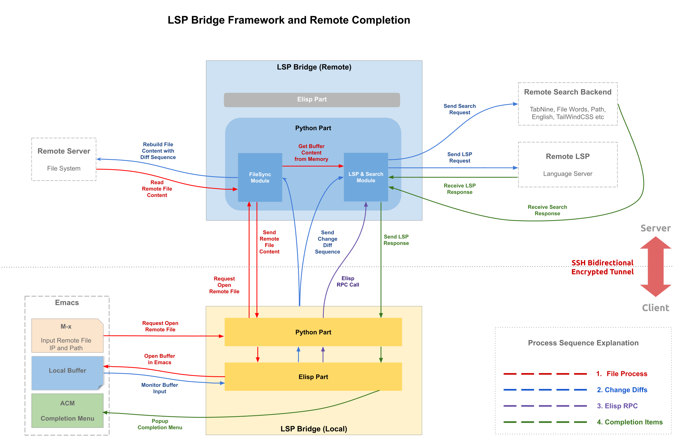

<p align="left">
<a href="https://github.com/manateelazycat/lsp-bridge/actions/workflows/test.yml"></a> <a href ="https://github.com/manateelazycat/lsp-bridge/blob/master/README.zh-CN.md"></a>

<hr>
  <a href="https://github.com/manateelazycat/lsp-bridge?tab=readme-ov-file#installation"><strong>Installation</strong></a> •
  <a href="https://github.com/manateelazycat/lsp-bridge?tab=readme-ov-file#supported-language-servers"><strong>Support languages</strong></a> •
  <a href="https://github.com/manateelazycat/lsp-bridge?tab=readme-ov-file#keymap"><strong>Keymaps</strong></a> •
  <a href="https://github.com/manateelazycat/lsp-bridge?tab=readme-ov-file#lsp-server-options"><strong>Customize options</strong></a> •
  <a href="https://github.com/manateelazycat/lsp-bridge?tab=readme-ov-file#join-development"><strong>Join development</strong></a>
<hr>


# lsp-bridge

The goal of lsp-bridge is to implement the fastest LSP client in the Emacs ecosystem using multi-threading technology, with a plug-and-play design philosophy to save you time and effort, because time is money.

Advantages of lsp-bridge:
1. Blazingly fast: Offload LSP request and data analysis to an external process, preventing Emacs from getting stuck due to delays or large data triggering garbage collection
2. Remote Completion: Built-in support for remote server code completion, with various login methods such as passwords and public keys, supports tramp protocol and jump server, supports Docker
3. Plug and play: Can be used immediately after installation, requires no additional configuration, no need to manually set up frontend completion, backend completion, or multi-backend integration configurations, code completion also works in org-mode src blocks
4. Multi-server fusion: A simple JSON is all you need to combine multiple LSP Servers into one file that provides services for example Python which offers code completion with Pyright and diagnostic and formatting capabilities with Ruff
5. Flexible Customization: Customizing LSP server options is as simple as using a JSON file, allowing different projects to have different JSON configurations with just a few lines of rules


### The video explains the principle of lsp-bridge

| <a href="https://emacsconf.org/2022/talks/lspbridge/">EmacsConf 2022 talk page</a> |
| :--------:
| [](https://www.youtube.com/watch?v=vLdqcYafY8w) |

## Installation

1. Install Emacs 28 or higher version
2. Install Python dependencies: `pip3 install epc orjson sexpdata six setuptools paramiko rapidfuzz watchdog packaging` (orjson is optional, orjson is based on Rust, providing faster JSON parsing performance). This step can be skipped if you set `pipx` or `uv` to the lsp-bridge-python-command.
3. Install Elisp dependencies: [markdown-mode](https://github.com/jrblevin/markdown-mode), [yasnippet](https://github.com/joaotavora/yasnippet)

4. Download this repository using git clone, and replace the load-path path in the configuration below.
5. Add the following code to your configuration file ~/.emacs:

```elisp
(add-to-list 'load-path "<path-to-lsp-bridge>")

(require 'yasnippet)
(yas-global-mode 1)

(require 'lsp-bridge)
(global-lsp-bridge-mode)
```

Note: To enable completion in the terminal, please install the latest version of Emacs, which supports tty-child-frames.

* If you are using straight to install, you should use the following configuration to install:

```elisp
(use-package lsp-bridge
  :straight '(lsp-bridge :type git :host github :repo "manateelazycat/lsp-bridge"
            :files (:defaults "*.el" "*.py" "acm" "core" "langserver" "multiserver" "resources")
            :build (:not compile))
  :init
  (global-lsp-bridge-mode))
```

* If you are using `doom-emacs`

add this to your `packages.el`

``` elisp
(when (package! lsp-bridge
        :recipe (:host github
                 :repo "manateelazycat/lsp-bridge"
                 :branch "master"
                 :files ("*.el" "*.py" "acm" "core" "langserver" "multiserver" "resources")
                 ;; do not perform byte compilation or native compilation for lsp-bridge
                 :build (:not compile)))
  (package! markdown-mode)
  (package! yasnippet))
```

and add this to your `config.el`

``` elisp
(use-package! lsp-bridge
  :config
  (global-lsp-bridge-mode))
```

and run `doom sync` to install it.

### If you are unable to use normally after installing it, please read [Report bug](https://github.com/manateelazycat/lsp-bridge?tab=readme-ov-file#report-bug) first

Please note:

1. When using lsp-bridge, please first disable other completion plugins, such as lsp-mode, eglot, company, corfu, etc. lsp-bridge provides a complete solution from the completion backend, completion frontend to multi-backend integration
2. In addition to providing LSP completion, lsp-bridge also provides many non-LSP completion backends, including capf, file words, paths, Yas/Tempel, TabNine, Codeium, Copilot, Tabby, Citre, Ctags, Org roam and other completion backends. If you expect to provide these completions in a certain mode, please add the corresponding mode to `lsp-bridge-default-mode-hooks`. Customize the order of backend, please check `acm-backend-order`.
3. Please do not perform ```byte compilation``` or ```native compilation``` for lsp-bridge as it will result in a difference in API and the latest version after upgrading compiling afterwards, Lsp-bridge is designed with multi-threading that does not require compilation to speed it up

## Local Usage

Lsp-bridge works plug-and-play. After installing the corresponding [LSP server](https://github.com/manateelazycat/lsp-bridge#supported-language-servers) and mode plugin for the language, you can start coding directly without any additional settings.

It should be noted that lsp-bridge has three scanning modes:

1. Determine the project's root directory by searching upward for a `.git` or `.dir-locals.el` file, thereby providing completion for the entire project directory.
2. If a `.git` or `.dir-locals.el` file is not found, lsp-bridge will only provide single file completion for the opened file.
3. You can also tell lsp-bridge the root directory of the project by customizing the `lsp-bridge-get-project-path-by-filepath` function. This function takes the path string of the opened file as the input parameter and outputs the project directory path.

## Remote Usage

### Remote SSH server
`lsp-bridge` can perform code syntax completion on files on a remote server, similar to VSCode. The configuration steps are as follows:

1. Install lsp-bridge and the corresponding LSP Server on the remote server.
2. Start lsp-bridge: `python3 lsp-bridge/lsp_bridge.py`.
3. Use the `lsp-bridge-open-remote-file` command to open files, entering the username, IP, SSH port (default 22), and path, such as `user@ip:[ssh_port]:/path/file`
4. Enabling the `lsp-bridge-enable-with-tramp` option allows direct opening of tramp files, using the efficient algorithm of lsp-bridge instead of tramp, achieving smooth completion. If the host in tramp is defined in `~/.ssh/config`, lsp-bridge can synchronize the following options for remote connection:
   - HostName (must be in IP format, domain format may cause issues)
   - User
   - Port
   - GSSAPIAuthentication
   - ProxyCommand (currently only supports ProxyCommand option, does not support ProxyJump option)
5. `(setq lsp-bridge-remote-start-automatically t)` can automatically
start the lsp_bridge.py process on the remote host (which needs to support bash) when opening a tramp file, and it will also automatically close the process when quitting emacs. When using this feature, the following options need to be correctly set:
    - lsp-bridge-remote-python-command: the name of the python command on the remote host
    - lsp-bridge-remote-python-file: the full path of lsp_bridge.py on the remote host
    - lsp-bridge-remote-log: the full path for log output of lsp_bridge.py on the remote host

Principle of remote completion:

1. Log in to the server with SSH authentication, access and edit files.
2. When editing a replica of a remote file, real-time diff sequences will be sent to lsp-bridge, and the server side will use these sequences to rebuild the file and calculate the completion data by the remote LSP Server.
3. The remote LSP Server will send back the completion data to the local side, and Emacs will display the completion menu.

Note:

1. If the completion menu is not displayed, check the output of `lsp_bridge.py` on the remote server, it may be that the LSP Server is not fully installed.
2. lsp-bridge will use the first *.pub file in `~/.ssh` as a login credential. If public key login fails, you will be asked to enter a password. lsp-bridge will not store the password, it is recommended to use public key login to avoid repeated password entry.
3. To run lsp_bridge.py successfully you need to completely download the entire git repository of lsp-bridge on a remote server, and switch into its directory, lsp_bridge.py requires other files to function properly, so copying only the lsp_bridge.py file can't work
4. If a tramp file encounters an lsp-bridge connection error, you can execute the `lsp-bridge-tramp-show-hostnames` function and then check if the output of the host configuration options meets expectations
5. If you encounter errors like `remote file ... is updating info... skip call ...`, please ensure that you open the file via SSH and note that ivy-mode may interfere with `C-x C-f`

### Local devcontainer
`lsp-bridge` now support completion on files on `devcontainer`, similar to VSCode. This is done by using [devcontainer-feature-emacs-lsp-bridge](https://github.com/nohzafk/devcontainer-feature-emacs-lsp-bridge).

Here is a compelte configuration example

#### devcontainer.json
`.devcontainer/devcontainer.json`

``` json
{
    "name": "Ubuntu",
    // Your base image
    "image": "mcr.microsoft.com/devcontainers/base:jammy",
    // Features to add to the dev container. More info: https://containers.dev/features.
    "features": {
        "ghcr.io/nohzafk/devcontainer-feature-emacs-lsp-bridge/gleam:latest": {}
    },
    "forwardPorts": [
        9997,
        9998,
        9999
    ],
    // More info: https://aka.ms/dev-containers-non-root.
    "remoteUser": "vscode"
}
```

start the devcontainer and use `file-find` `/docker:user@container:/path/to/file` to open the file.

If you use `apheleia` as formatter, `lsp-bridge` now support auto formatting file on devcontainer.
```elisp
;; setup PATH for remote command execution
(with-eval-after-load 'tramp
  (add-to-list 'tramp-remote-path "~/.nix-profile/bin")
  (add-to-list 'tramp-remote-path 'tramp-own-remote-path))

(use-package apheleia
  :config
  ;; which formatter to use
  (setf (alist-get 'python-mode apheleia-mode-alist) 'ruff)
  (setf (alist-get 'python-ts-mode apheleia-mode-alist) 'ruff)
  ;; don't mess up with lsp-mode
  (setq +format-with-lsp nil)
  ;; run the formatter inside container
  (setq apheleia-remote-algorithm 'remote))
```

more detail about using lsp-bridge in devcontainer please refer to [emacs-devcontainer](https://github.com/nohzafk/emacs-devcontainer).

## Keymap

| Key          | Command                   | Description                                                                                                                   |
|:-------------|:--------------------------|:------------------------------------------------------------------------------------------------------------------------------|
| Alt + n      | acm-select-next           | Select next candidate                                                                                                         |
| Down         | acm-select-next           | Select next candidate                                                                                                         |
| Alt + p      | acm-select-prev           | Select previous candidate                                                                                                     |
| Up           | acm-select-prev           | Select previous candidate                                                                                                     |
| Alt + ,      | acm-select-last           | Select last candidate                                                                                                         |
| Alt + .      | acm-select-first          | Select first candidate                                                                                                        |
| Ctrl + v     | acm-select-next-page      | Select next page candidate                                                                                                    |
| Alt + v      | acm-select-prev-page      | Select previous page candidate                                                                                                |
| Ctrl + m     | acm-complete              | Complete completion                                                                                                           |
| Return       | acm-complete              | Complete completion                                                                                                           |
| Tab          | acm-complete              | Complete completion                                                                                                           |
| Alt + h      | acm-complete              | Complete completion                                                                                                           |
| Alt + H      | acm-insert-common         | Insert common part of candidates                                                                                              |
| Alt + u      | acm-filter                | Performing second-level filtering on candidate words, similar to the fuzzy search feature in other auto-complete frontends                         |
| Alt + d      | acm-doc-toggle            | Enable or disable candidate documentation                                                                                     |
| Alt + j      | acm-doc-scroll-up         | Scroll up candidate documentation                                                                                             |
| Alt + k      | acm-doc-scroll-down       | Scroll down candidate documentation                                                                                           |
| Alt + l      | acm-hide                  | Hide completion menu                                                                                                          |
| Ctrl + g     | acm-hide                  | Hide completion menu                                                                                                          |
| Alt + Number | acm-complete-quick-access | Selecting candidate quickly, need to enable `acm-enable-quick-access` first                                                   |
| Number       | acm-complete-quick-access | Selecting candidate (even more) quickly, need both `acm-enable-quick-access` and `acm-quick-access-use-number-select` enabled |

## Commands

- `lsp-bridge-find-def`: jump to the definition
- `lsp-bridge-find-def-other-window`: jump to the definition in other-window
- `lsp-bridge-find-def-return`: return to the location before calling `lsp-bridge-find-def`
- `lsp-bridge-find-type-def`: Jump to the position of type definition.
- `lsp-bridge-find-type-def-other-window`: Jump to the position of type definition in another window.
- `lsp-bridge-find-impl`: jump to the implementation
- `lsp-bridge-find-impl-other-window`: jump to the implementation in other-window
- `lsp-bridge-find-references`: traverse across code references (forked from color-rg.el)
- `lsp-bridge-popup-documentation`: lookup documentation of symbol under the cursor
- `lsp-bridge-popup-documentation-scroll-up`: scroll up popup document.
- `lsp-bridge-popup-documentation-scroll-down`: scroll down popup document.
- `lsp-bridge-show-documentation`: lookup documentation of symbol under the cursor, but using a buffer instead
- `lsp-bridge-rename`: rename symbol under the cursor
- `lsp-bridge-diagnostic-jump-next`: Jump to the next diagnostic position
- `lsp-bridge-diagnostic-jump-prev`: Jump to the previous diagnostic position
- `lsp-bridge-diagnostic-list`: List all diagnostic information
- `lsp-bridge-diagnostic-copy`: Copy the current diagnostic information to the clipboard
- `lsp-bridge-code-action`: Popup code action menu, you can pass special `actin-kind` to fix, `action-kind` can use one of "quickfix", "refactor", "refactor.extract", "refactor.inline", "refactor.rewrite", "source", "source.organizeImports", "source.fixAll"
- `lsp-bridge-workspace-list-symbol-at-point`: Finds the definition of a symbol at the cursor point
- `lsp-bridge-workspace-list-symbols`: List all symbols in workspace and jump to the symbol definition
- `lsp-bridge-signature-help-fetch`: show signature help in minibuffer manually (move cursor to parameters area will show signature help automatically)
- `lsp-bridge-popup-complete-menu`: Manually popup the completion menu, you only need this command when turn on option `lsp-bridge-complete-manually`
- `lsp-bridge-restart-process`: restart lsp-bridge process (only used for development)
- `lsp-bridge-toggle-sdcv-helper`: Switch dictionary completion assistant
- `lsp-bridge-peek-abort`: Close peek window (default binding to `C-g`)
- `lsp-bridge-peek-list-next-line`: Select the next definition or reference (default binding to `M-S-n`)
- `lsp-bridge-peek-list-prev-line`: Select the previous definition or reference (default binding to `M-S-p`)
- `lsp-bridge-peek-file-content-next-line`: Scroll down one line in the peek window file content (default binding to `M-n`)
- `lsp-bridge-peek-file-content-prev-line`: Scroll up one line in the peek window file content (default binding to `M-p`)
- `lsp-bridge-peek-jump`: Jump to the location of the definition or reference (default binding to `M-l j`)
- `lsp-bridge-peek-jump-back`: Jump back to the original position (default bound to `M-l b`)
- `lsp-bridge-peek-through`: View one symbol in the peek window
- `lsp-bridge-peek-tree-previous-branch`: Select the previous branch at the same level in the browsing history (default binding to `<up>`)
- `lsp-bridge-peek-tree-next-branch`: Select the next branch at the same level in the browsing history (default binding to `<down>`)
- `lsp-bridge-peek-tree-previous-node`: Select the previous higher-level node in the browsing history (default binding to `<left>`)
- `lsp-bridge-peek-tree-next-node`: Select the next lower-level node in the browsing history (default binding to `<right>`)
- `lsp-bridge-indent-left`: Indents the pasted text to the left according to the indent values defined in `lsp-bridge-formatting-indent-alist`
- `lsp-bridge-indent-right`: Indents the pasted text to the right according to the indent values defined in `lsp-bridge-formatting-indent-alist`
- `lsp-bridge-semantic-tokens-mode`: Enables or disables semantic token highlighting, please ref to [Semantic Tokens Wiki](https://github.com/manateelazycat/lsp-bridge/wiki/Semantic-Tokens)

## LSP server options
lsp-bridge provides support for more than two language servers for many languages. You can customize the following options to choose the language server you prefer:

- `lsp-bridge-c-lsp-server`: C language server, you can choose `clangd` or`ccls`
- `lsp-bridge-elixir-lsp-server`: Elixir language server, you can choose `elixirLS`(default), `lexical` or `nextls`
- `lsp-bridge-python-lsp-server`: Python language server, you can choose `basedpyright`, `pyright`, `jedi`, `python-ms`, `pylsp`, `ruff`, it's important to note that lsp-bridge-multi-lang-server-mode-list has a higher priority than lsp-bridge-single-lang-server-mode-list. If you only want to use a single server, please first remove the python-mode setting from lsp-bridge-multi-lang-server-mode-list.
- `lsp-bridge-php-lsp-server`: PHP language server, you can choose `intelephense` or `phpactor`
- `lsp-bridge-tex-lsp-server`: LaTeX language server, you can choose `texlab`, `digestif` or `ltex-ls`
- `lsp-bridge-csharp-lsp-server`: C# language server, you can choose `omnisharp-mono`, `omnisharp-dotnet` or `csharp-ls`, note that you need to give **execute permissions** to the OmniSharp file
- `lsp-bridge-python-multi-lsp-server`: Python multi-language servers, you can choose `basedpyright_ruff`, `pyright_ruff`, `jedi_ruff`, `python-ms_ruff`, `pylsp_ruff`
- `lsp-bridge-nix-lsp-server`: Nix language server, you can choose `rnix-lsp`, `nixd` or `nil`
- `lsp-bridge-markdown-lsp-server`: Markdown language server, you can choose `vale-ls` or `marksman`
- `lsp-bridge-lua-lsp-server`: Lua language server, you can choose `sumneko` or `lua-lsp`
- `lsp-bridge-verilog-lsp-server`: Verilog language server， you can choose `verible`, or `svls`
- `lsp-bridge-xml-lsp-server`: XML language server， you can choose `lemminx`, or `camells`
- `lsp-bridge-cmake-lsp-server`: CMake language server， you can choose `cmake-language-server`, or `neocmakelsp`

## Options

- `lsp-bridge-python-command`: The path of the python command, if you use `conda`, you may customize this option. Windows platform using `python.exe` rather than `python3`, if lsp-bridge can’t work, try set to `python3`. If you set `pipx` or `uv`, these are translated to `pipx run` or `uv run` which execute the lsp_bridge.py in a temporal virtual environment where dependencies are automatically installed.
- `lsp-bridge-complete-manually`: Only popup completion menu when user call `lsp-bridge-popup-complete-menu` command, default is nil
- `lsp-bridge-enable-with-tramp`: When this option is enabled, lsp-bridge provides remote autocompletion support for files opened by tramp. It requires the lsp_bridge.py to be installed and started on the server side in advance. Note that this option only uses tramp to open files, it does not use tramp technology to implement autocompletion, because the implementation principle of tramp has serious performance issues. 'One should note that if you usually use the command `lsp-bridge-open-remote-file`, you need to disable the option `lsp-bridge-enable-with-tramp` to ensure that the file opened by the command can correctly jump to the definitions or references.
- `lsp-bridge-remote-save-password`: Saves the password for remote editing to the netrc file, disabled by default
- `lsp-bridge-remote-heartbeat-interval`: Interval for sending heartbeat to server in seconds, disabled by default, set it to a suitable value for your server sshd if you want to keep the connection alive after a long idle time.
- `lsp-bridge-get-workspace-folder`: You need to put multiple project in a `workspace` directory in Java before you can jump function defintion normally. This function can be customized, the function input is the project path and returns the `workspace` directory corresponding
- `lsp-bridge-default-mode-hooks`: The list of modes that automatically start lsp-bridge, you can customize this option to control the scope of starting lsp-bridge
- `lsp-bridge-org-babel-lang-list`: list of language to support org-mode code block completion, nil enable all languages, default is nil
- `lsp-bridge-find-def-fallback-function`: When LSP cannot find a definition, you can customize this function for candidate jumping, such as binding the citre function
- `lsp-bridge-find-ref-fallback-function`: When LSP cannot find a reference, you can customize this function for candidate jumping, such as binding the citre  function
- `lsp-bridge-find-def-select-in-open-windows`: If this option is turned on, when searching for function definitions, already open windows will be selected instead of switching buffers. disable by default
- `lsp-bridge-enable-completion-in-string`: Enable completion pop-up within strings, disabled by default, if you only want to show completion popups in strings for certain languages, please customize the option `lsp-bridge-completion-in-string-file-types`
- `lsp-bridge-enable-completion-in-minibuffer`: Enable pop-completion up in Minibuffer, disabled by default
- `lsp-bridge-enable-diagnostics`: code diagnostic, enable by default
- `lsp-bridge-enable-inlay-hint`: inlay hint, disable by default, this option is use for strong type language, such as, Rust
- `lsp-bridge-enable-hover-diagnostic`: show diagnostic tooltip when cursor hover diagnostic place, disable by default
- `lsp-bridge-enable-search-words`: index the word of the file, enable by default
- `lsp-bridge-enable-auto-format-code`: automatic format code, disable by default
- `lsp-bridge-enable-signature-help`: show function parameter in minibufer, enable by default
- `lsp-bridge-log-level`: set LSP message level. see the `descript-variable lsp-bridge-log-level` for more detail, usually do no set it `debug` to avoid affecting performance
- `lsp-bridge-enable-debug`: enable program debugging, disable by default
- `lsp-bridge-disable-backup`: forbidden version manage of emacs, enable by default
- `lsp-bridge-code-action-enable-popup-menu`: enable code action popup menu, enable by default
- `lsp-bridge-diagnostic-fetch-idle`: diagnostic delay, start pulling diagnostic information 0.5 second after stopping typing
- `lsp-bridge-signature-show-function`: The function used for displaying signature info, default show message in minibuffer, set `lsp-bridge-signature-show-with-frame` to show signature info in frame
- `lsp-bridge-signature-show-with-frame-position`: When using `lsp-bridge-signature-show-with-frame` to display signature information, this option defines the position of the pop-up signature information, the default is `"bottom-right"`, you can also choose `"top-left"`, `"top-right"`, `"bottom-left"`, `"point"`
- `lsp-bridge-completion-popup-predicates`: the predicate function for completion menu, completion menu popup after all the functions pass
- `lsp-bridge-completion-stop-commands`: completion menu will not popup if these commands are executed
- `lsp-bridge-completion-hide-characters`: The default value is `‘(":" ";" "(" ")" "[" "]" "{" "}" ", " "\"")`, the completion menu does not pop up when the cursor is behind these characters. You can customize this option to remove this restriction, or call the `lsp-bridge-popup-complete-menu` command to force the menu to pop up. To make this option works, you need to set `lsp-bridge-completion-obey-trigger-characters-p` to nil.
- `lsp-bridge-user-langserver-dir`: the dir where user place langserver configuration file, if the configuration file name in the dir is the same as that in [lsp-bridge/langserver](https://github.com/manateelazycat/lsp-bridge/tree/master/langserver) , lsp-bridge will use the configuration file in this dir
- `lsp-bridge-user-multiserver-dir`: the dir where user place multiserver configuration file, if the configuration file name in the dir is the same as that in [lsp-bridge/multiserver](https://github.com/manateelazycat/lsp-bridge/tree/master/multiserver) , lsp-bridge will use the configuration file in this dir
- `lsp-bridge-symbols-enable-which-func`: Using lsp backend for `which-func`, disable by default
- `lsp-bridge-enable-org-babel`: Use lsp completion in org babel, disable by default
- `lsp-bridge-peek-file-content-height`: Display how many lines of file content in peek windows
- `lsp-bridge-peek-file-content-scroll-margin`: Set how many lines of file content should be scroll up and down.
- `lsp-bridge-peek-list-height`: Select the next option for definition and reference
- `lsp-bridge-peek-ace-keys`: Keys to press when performing `lsp-bridge-peek-through`
- `lsp-bridge-peek-ace-cancel-keys`: Keys to exit `lsp-bridge-peek-through`
- `acm-backend-order`: Customize the order of the completion backends
- `acm-frame-background-dark-color`: Menu background color in dark theme
- `acm-frame-background-light-color`: Menu background color in light theme
- `acm-enable-capf`: Provides capf completion support for non-LSP backends, it is disabled by default
- `acm-enable-doc`: Whether the complete menu display the help document
- `acm-enable-doc-markdown-render`: Richly render Markdown for completion popups, you can choose `'async`, `t` or `nil`. When set to `'async`, styles are applied asynchronously, choose `t`, styles are applied synchronously and will slow down the completion speed, default is `'async`
- `acm-enable-icon`: Whether the completion menu displays icons (Many macOS users have reported that emacs-plus28 cannot display icons properly, showing colored squares instead. There are two ways to solve this: install Emacs Mac Port or add the `--with-rsvg` option to the brew command when compiling Emacs yourself)
- `acm-enable-tabnine`: Enable tabnine support， enable by default， when enable need execute `lsp-bridge-install-tabnine` command to install TabNine, and it can be used. TabNine will consume huge CPUs, causing your entire computer to be slow. If the computer performance is not good, it is not recommended to enable this option
- `acm-enable-codeium`: Enable Codeium support, when enable need execute `lsp-bridge-install-update-codeium` command to install Codeium, then execute `lsp-bridge-codeium-auth` command to get auth token and execute `lsp-bridge-codeium-input-auth-token` command to get API Key, and it can be used.
- `acm-enable-copilot`: Enable copilot support, firstly, purchase the Copilot service by https://github.com/features/copilot , when enable need install agent first `npm install -g @github/copilot-language-server`, then execute `lsp-bridge-copilot-login`, lsp-bridge will display User Code in the Minibuffer, copy the User Code to the opened Copilot page to complete the login.
- `acm-enable-search-file-words`: Whether the complete menu display the word of the file, enable by default
- `acm-enable-quick-access`: Whether to display an index after the icon, quickly select candidate words using Alt + Number, default is off
- `acm-quick-access-use-number-select`: Whether to use number keys for quick selection of candidate words, default is off, turning on this option may sometimes interfere with number input or accidentally select candidate words
- `acm-enable-yas`: yasnippet completion, enable by default
- `acm-enable-citre`: Integration with [citre(ctags)](https://github.com/universal-ctags/citre). Enable this to add citre (ctags) backend (disabled by default)
- `acm-enable-lsp-workspace-symbol`: Enable LSP workspace symbol completion, disabled by default
- `acm-doc-frame-max-lines`: Max line number of help documentation, default is 20
- `acm-candidate-match-function`: lsp-bridge frontend filter algorithm for candidates, options include `'regexp-quote`, `'orderless-flex`, `'orderless-literal`, `'orderless-prefixes`, `'orderless-regexp`, `'orderless-initialism`, default is `regexp-quote`, orderless-* started algorithms require additional installation of [orderless](https://github.com/oantolin/orderless)
- `acm-completion-mode-candidates-merge-order`: Customize the order of the mode candidates, the display order for mode candidates, default order: Elisp、 LSP、 Jupyter、 Tabby Ctags、 Citre、 ROAM、 Word、 Telegra
- `acm-backend-lsp-candidate-min-length`: The minimum characters to trigger lsp completion, default is 0
- `acm-backend-lsp-block-kind-list`: Filters certain types of LSP completion candidates. By default, it's a empty list. When the value is set to `'(Snippet Enum)`, this means that Snippet and Enum completions will not be shown.
- `acm-backend-elisp-candidate-min-length`: The minimum characters to trigger elisp completion, default is 0
- `acm-backend-yas-candidate-min-length`: The minimum characters to trigger yasnippet completion, default is 0
- `acm-backend-search-file-words-candidate-min-length`: The minimum characters to trigger search file words completion, default is 0
- `acm-backend-search-file-words-max-number`: Search Words completion candidate limit, default is 10
- `acm-backend-search-file-words-enable-fuzzy-match`: Search Words completion candidate fuzzy match, disable by default
- `acm-backend-search-file-words-enable-fuzzy-match-threshold`: Search Words completion candidate fuzzy match threshold, Filter out words with a ratio lower than the threshold, default is 50
- `acm-backend-codeium-candidate-min-length`: The minimum characters to trigger codeium completion, default is 0
- `acm-backend-lsp-enable-auto-import`: Automatic insert import code, enable by default
- `acm-backend-lsp-candidate-max-length`: Maximum length of LSP candidate, some language, such as Java, argument list is very long, you can increase the value of this option to see clear argument list
- `acm-backend-yas-candidates-number`: yasnippet display number， 2 by default
- `acm-backend-citre-keyword-complete`: Completion is performed according to the keywords of each mode defined by `acm-backend-citre-keywords-alist`, which takes effect only after citre is enabled.
- `acm-backend-search-sdcv-words-dictionary`: StarDict dictionary for word completion, default is `kdic-ec-11w`, you can replace it with StarDict dictionary path, example, if you have dictionary `/usr/share/stardict/dic/stardict-oxford-gb-formated-2.4.2/oxford-gb-formated.ifo`, you need set this value to `/usr/share/stardict/dic/stardict-oxford-gb-formated-2.4.2/oxford-gb-formated`, not include `.ifo` extension.
- `acm-backend-lsp-match-mode`: The filtering mode for candidates in LSP backend, there are three options: "prefix", "prefixCaseSensitive", and "fuzzy". By default it is "fuzzy"
- `acm-backend-lsp-frontend-filter-p`: Since LSP candidates have been filtered in the Python backend, it's not necessary to perform an additional filter on the frontend (refer to option `acm-candidate-match-function`), disable by default, when set to `t`, this option will call the `acm-candidate-match-function` function on the frontend to filter LSP candidates again
- `acm-backend-lsp-show-progress`: show working progress, disable by default
- `acm-enable-preview`: enable Tab-and-Go completion, commands like acm-select-* will select and preview other candidate and further input will then commit this candidate, disable by default

## Supported language servers

You need to install the LSP server corresponding to each programming language, then lsp-bridge can provide code completion service.

If your language supports mixed multi-language servers, it is recommended to check the multi-language server definition under [multiserver](https://github.com/manateelazycat/lsp-bridge/tree/master/multiserver), and install multiple LSP servers to get a more complete experience. For example, for the Python language, according to the default [basedpyright_ruff.json](https://github.com/manateelazycat/lsp-bridge/tree/master/multiserver/basedpyright_ruff.json) definition, you should install `basedpyright` and `ruff`.

| Language    | LSP Server                                                                                         | Note                                                                                                                                                                                                                                                                |
|:------------|:---------------------------------------------------------------------------------------------------|:--------------------------------------------------------------------------------------------------------------------------------------------------------------------------------------------------------------------------------------------------------------------|
| Ada         | [ada_language_server](https://github.com/AdaCore/ada_language_server)                      |                                                                 |
| Ansible     | [ansible-language-server](https://github.com/ansible/ansible-language-server)                      | Ansible uses YAML as source code, you’ll need to customize `lsp-bridge-get-single-lang-server-by-project` to return "ansible-language-server".                                                                                                                      |
| Angular     | [angular-language-server](https://github.com/angular/vscode-ng-language-service)                      | `npm i -g @angular/language-server @angular/language-service typescript emmet-ls vscode-langservers-extracted typescript-language-server`                                                                                                                  |
| Astro       | [astro](https://github.com/withastro/language-tools/tree/main/packages/language-server)            | `npm i -g @astrojs/language-server`                                                                                                                                                                                                                                 |
| Ballerina        | [ballerina-lang-server](https://github.com/ballerina-platform/ballerina-lang)                           |                                                                                                                                                                                                                               |
| Bash        | [bash-language-server](https://github.com/bash-lsp/bash-language-server)                           |                                                                                                                                                                                                                                                                     |
| Beancount   | [beancount-language-server](https://github.com/polarmutex/beancount-language-server)               | `cargo install beancount-language-server`                                                                                                                                                                                                                             |
| BibTex   | [citation-langserver](https://github.com/oncomouse/citation-langserver)               |   |
| Clojure     | [clojure-lsp](https://github.com/clojure-lsp/clojure-lsp)                                          | If you use `homebrew`, please ensure install `clojure-lsp/brew/clojure-lsp-native` [clojure-lsp-native](https://clojure-lsp.io/installation/#homebrew-macos-and-linux)                                                                                             |
| Cmake       | [cmake-language-server](https://github.com/regen100/cmake-language-server)                         | `pip install cmake-language-server`                                                                                                                                                                                                                                 |
|            | [neocmakelsp](https://github.com/neocmakelsp/neocmakelsp)                         |                                                                                                                                                                                            |
| Cobol       | [che-che4z-lsp-for-cobol](https://github.com/eclipse-che4z/che-che4z-lsp-for-cobol)                         |                                                                                                                                |
| CSS         | [vscode-css-language-server](https://github.com/hrsh7th/vscode-langservers-extracted)              | `npm i -g vscode-langservers-extracted`                                                                                                                                                                                                                             |
| Cucumber         | [cucumber-language-server](https://github.com/cucumber/language-server)              | `npm install @cucumber/language-server`                                                                                                                                                                                       |
| C#          | [csharp-ls](https://github.com/razzmatazz/csharp-language-server)                                    | Use command `dotnet tool install -g csharp-ls` install csharp-ls, `lsp-bridge-csharp-lsp-server` set to `csharp-ls`                                                                                   |
|             | [omnisharp-dotnet](https://github.com/OmniSharp/omnisharp-roslyn)                                  | OmniSharp is a .NET development platform based on Roslyn workspaces. use `M-x lsp-bridge-install-omnisharp` to install it. `lsp-bridge-csharp-lsp-server` set to `omnisharp-dotnet` (6.0)                                                                           |
|             | [omnisharp-mono](https://github.com/OmniSharp/omnisharp-roslyn)                                    | OmniSharp is a .NET development platform based on Roslyn workspaces. use `M-x lsp-bridge-install-omnisharp` to install it. `lsp-bridge-csharp-lsp-server` set to `omnisharp-mono`                                                                                   |
| C++         | [clangd](https://github.com/clangd/clangd)                                                         | You need to configure `compile_commands.json` or `CMakeLists.txt` files in root directory of project                                                                                                                                                                      |
|             | [ccls](https://github.com/MaskRay/ccls)                                                            | `lsp-bridge-c-lsp-server` set to `ccls`, you need to configure `compile_commands.json` first                                                                                                                                                                          |
| C           | [clangd](https://github.com/clangd/clangd)                                                         | You need to configure `compile_commands.json` or `CMakeLists.txt` files in root directory of project                                                                                                                                                                      |
|             | [ccls](https://github.com/MaskRay/ccls)                                                            | `lsp-bridge-c-lsp-server` set to `ccls`, you need to configure `compile_commands.json` first                                                                                                                                                                          |
| Common Workflow           | [benten](https://github.com/rabix/benten)                                                       | `pip3 install benten`                                                            |
| D           | [serve-d](https://github.com/Pure-D/serve-d)                                                       | `serve-d` does not support single file mode, please init `.git` repository under project root at first or custom `lsp-bridge-get-project-path-by-filepath` function                                                                                                     |
| Dart        | [dart-analysis-server](https://github.com/dart-lang/sdk/tree/master/pkg/analysis_server)           |                                                                                                                                                                                                                                                                     |
| Deno        | [deno](https://deno.land)                                                                          | Deno runtime use TypeScript as source code, you need customize option `lsp-bridge-get-single-lang-server-by-project` that return result "deno" when project-path match Deno project.                                                                              |
| Dockerfiles | [docker-language-server](https://github.com/rcjsuen/dockerfile-language-server-nodejs)             |                                                                                                                                                                                                                                                                     |
| Elixir      | [elixirLS](https://github.com/elixir-lsp/elixir-ls)                                                | Please ensure that the `elixir-ls` release directory is in your system PATH at first                                                                                                                                                                                |
|             | [lexical](https://github.com/lexical-lsp/lexical)                                                  | Kindly make sure that the `lexical` release directory is included in your system’s PATH and that `lexical` has been compiled using the same version of Elixir/Erlang as your project.                                                                               |
|             | [nextls](https://github.com/elixir-tools/next-ls)                                                  |                                                                                                                                                                                                                                                                     |
| Elm         | [elm-language-server](https://github.com/elm-tooling/elm-language-server)                          |                                                                                                                                                                                                                                                                     |
| Erlang      | [erlang-ls](https://github.com/erlang-ls/erlang_ls)                                                |                                                                                                                                                                                                                                                                     |
| Fennel     | [fennel-ls](https://git.sr.ht/~xerool/fennel-ls)                                                         |                                                                                                                                                                                                                               |
| Fortran     | [fortls](https://github.com/gnikit/fortls)                                                         |                                                                                                                                                                                                                                                                     |
| Futhark     | [futhark-lsp](https://futhark-lang.org)                                         |                                                                                                                                                                                                                               |
| Fuzion     | [fuzion-lsp-server](https://github.com/tokiwa-software/fuzion-lsp-server)                                         |                                                                                                                                                                                                                               |
| F#          | [fsautocomplete](https://github.com/fsharp/FsAutoComplete)                                         |                                                                                                                                                                                                                                                                     |
| Gleam       | [gleam lsp](https://gleam.run/news/v0.21-introducing-the-gleam-language-server/)                   |
| GLSL        | [glsl-language-server](https://github.com/svenstaro/glsl-language-server)                   |                                                                                                                                                                                                                               |
| Go          | [gopls](https://github.com/golang/tools/tree/master/gopls)                                         | Make sure install [go-mode](https://github.com/dominikh/go-mode.el) and `gopls` in PATH, please do `ln -s ~/go/bin/gopls ~/.local/bin`, and do `go mod init` first                                                                                                    |
| GraphQL     | [graphql-lsp](https://github.com/graphql/graphiql/tree/main/packages/graphql-language-service-cli) |                                                                                                                                                                                                                                                                     |
| Groovy      | [groovy-language-server](https://github.com/GroovyLanguageServer/groovy-language-server)           | Create a script "groovy-language-server" in PATH, with `$JAVA_HOME/bin/java -jar <path>/groovy-language-server-all.jar`                                                                                                                                             |
| Haskell     | [hls](https://github.com/haskell/haskell-language-server)                                          |                                                                                                                                                                                                                                                                     |
| HLASM     | [che-che4z-lsp-for-hlasm](https://github.com/eclipse-che4z/che-che4z-lsp-for-hlasm)                                          |                                                                                                                                                                                                                               |
| HTML        | [vscode-html-language-server](https://github.com/hrsh7th/vscode-langservers-extracted)             | `npm i -g vscode-langservers-extracted`                                                                                                                                                                                                                             |
| Java        | [eclipse.jdt.ls](https://projects.eclipse.org/projects/eclipse.jdt.ls)                             | Please ensure that `org.eclipse.jdt.ls.product/target/repository/bin` is in your system PATH at first, please see the details at [Wiki](https://github.com/manateelazycat/lsp-bridge/wiki/Eclipse-JDT-Language-Server)                                              |
| Javascript       | [typescript](https://github.com/microsoft/TypeScript)                                               | `npm i -g typescript`                                                                                                                                                                                                                                                |
|             | [typescript-language-server](https://github.com/typescript-language-server/typescript-language-server) | `npm i -g typescript-language-server`                                                                                                                                                                                                                               |
| JSON        | [vscode-json-language-server](https://github.com/hrsh7th/vscode-langservers-extracted)             | `npm i -g vscode-langservers-extracted`                                                                                                                                                                                                                             |
| Jsonnet        | [jsonnet-language-server](https://github.com/grafana/jsonnet-language-server)             |                                                                                                                                                                                        |
| Julia       | [julials](https://github.com/julia-vscode/LanguageServer.jl)                                       |                                                                                                                                                                                                                                                                     |
| Kotlin      | [kotlin-language-server](https://github.com/fwcd/kotlin-language-server)                           | If you want Inlay Hints feature, you need build with source code to return Inlay Hint information                                                                                                                                                                   |
| Latex       | [digestif](https://github.com/astoff/digestif)                                                     | `lsp-bridge-tex-lsp-server` set to `digestif`                                                                                                                                                                                                                       |
|             | [texlab](https://github.com/latex-lsp/texlab)                                                      | `lsp-bridge-tex-lsp-server` set to `texlab`                                                                                                                                                                                                                         |
|             | [ltex-ls](https://github.com/valentjn/ltex-ls)                                                      | `lsp-bridge-tex-lsp-server` set to `ltex-ls`                                                                                                                                                                                                                         |
| LESS        | [emmet-ls](https://github.com/aca/emmet-ls)                                                        | `npm install -g emmet-ls`                                                                                                                                                                                                                                           |
| Lua         | [sumneko](https://github.com/sumneko/lua-language-server)                                          | Please ensure `bin` under sumneko installation is in your system PATH at first                                                                                                                                                                                      |
|             | [lua-lsp](https://github.com/Alloyed/lua-lsp)                                          |                                                                                                                                                                           |
| Markdown    | [vale-ls](https://github.com/errata-ai/vale-ls)                                                    | Install `vale` first, then use `cargo build` and install `vale-ls` from github, and make sure `vale-ls` in PATH                                                                                                                                                             |
| Mint        | [mint-ls](https://www.mint-lang.com/)                                                           |                                                                                                                                                                                                |
| Mojo        | [mojo](https://www.modular.com/max/mojo)                                                           | modular install `mojo-lsp-server`                                                                                                                                                                                                                                     |
| Move        | [move-analyzer](https://github.com/move-language/move)                                             | The `move-analyzer` is included in the move language repository                                                                                                                                                                                                     |
| Nickel      | [nls](https://crates.io/crates/nickel-lang-lsp/)                                                   | `cargo add nickel-lang-lsp`                                                                                                                                                                                                                                           |
| Nix         | [nil](https://github.com/oxalica/nil)                                                              | `lsp-bridge-nix-lsp-server` set to `nil`                                                                                                                                                                                                                            |
|             | [rnix-lsp](https://github.com/nix-community/rnix-lsp)                                              | `lsp-bridge-nix-lsp-server` set to `rnix-lsp`                                                                                                                                                                                                                       |
|             | [nixd](https://github.com/nix-community/nixd)                                                      | `lsp-bridge-nix-lsp-server` set to `nixd`                                                                                                                                                                                                                           |
| Object-C    | [clangd](https://github.com/clangd/clangd)                                                         | You need to configure `compile_commands.json` or `CMakeLists.txt` files in root directory of project                                                                                                                                                                      |
|             | [ccls](https://github.com/MaskRay/ccls)                                                            | `lsp-bridge-c-lsp-server` set to `ccls`, you need to configure `compile_commands.json` first                                                                                                                                                                          |
| Odin       | [ols](https://github.com/DanielGavin/ols)                                                     |                                                                                                                                                                                                                               |
| Ocaml       | [ocamllsp](https://github.com/ocaml/ocaml-lsp)                                                     |                                                                                                                                                                                                                                                                     |
| OpenSCAD   | [openscad-lsp](https://github.com/Leathong/openscad-LSP?tab=readme-ov-file)                                               | `cargo install openscad-lsp`                                                              |
| Org-mode    | [ds-pinyin](https://github.com/iamcco/ds-pinyin-lsp)                                               | `cargo install ds-pinyin-lsp`, download `dict.db3` of `ds-pinyin`, and save to `~/.emacs.d/ds-pinyin/` directory, then turn on option `lsp-bridge-use-ds-pinyin-in-org-mode`                                                                                              |
|             | [Wen](https://github.com/metaescape/Wen)                                                           | `pip install pygls pypinyin`, then turn on option `lsp-bridge-use-wenls-in-org-mode`                                                                                                                                                                                |
| Perl        | [perl-language-server](https://github.com/richterger/Perl-LanguageServer)                          |                                                                                                                                                                                                       |
| PHP         | [intelephense](https://github.com/bmewburn/vscode-intelephense)                                    | `npm i intelephense -g`                                                                                                                                                                                                                                             |
|             | [Phpactor](https://github.com/phpactor/phpactor)                                                   | `lsp-bridge-php-lsp-server` set to `phpactor`                                                                                                                                                                                                                         |
| PureScript  | [purescript-language-server](https://github.com/nwolverson/purescript-language-server)                                           |                                                                         |
| Python      | [jedi](https://github.com/pappasam/jedi-language-server)                                           | `lsp-bridge-python-lsp-server` set to `jedi`                                                                                                                                                                                                                        |
|             | [pylsp](https://github.com/python-lsp/python-lsp-server)                                           | `lsp-bridge-python-lsp-server` set to `pylsp`                                                                                                                                                                                                                        |
|             | [basedpyright](https://detachhead.github.io/basedpyright)                                                    | `pip install basedpyright`, `lsp-bridge-python-lsp-server` set to `basedpyright`                                                                                                                   |
|             | [pyright](https://github.com/microsoft/pyright)                                                    | `lsp-bridge-python-lsp-server` set to `pyright`, `pyright-background-analysis` is faster sometimes, but it can’t response diagnostic informations                                                                                                                   |
|             | [python-ms](https://github.com/microsoft/python-language-server)                                   | Legacy language server for Python2                                                                                                                                                                                                                                  |
|             | [ruff](https://github.com/astral-sh/ruff)                                                          | `pip install ruff`, `lsp-bridge-python-lsp-server` is set to `ruff`, which only has the function of linter. If you need to complete the functions, install other Python language servers, and set the `lsp-bridge-python-multi-lsp-server` to `[LSP NAME]_ruff` |
| QML         | [qmlls](https://github.com/qt/qtdeclarative/tree/dev/tools/qmlls)                                  | The `qmlls` binary should be part of the normal Qt packages since Qt 6.3.0 Ensure that the directory of `qmlls` binary file is in PATH                                                                                                                              |
| Puppet           | [puppet-languageserver](https://github.com/puppetlabs/puppet-editor-services)                                |                                                                                                                                                                                                                               |
| R           | [rlanguageserver](https://github.com/REditorSupport/languageserver)                                |                                                                                                                                                                                                                                                                     |
| Racket      | [racket-langserver](https://github.com/jeapostrophe/racket-langserver)                             |                                                                                                                                                                                                                                                                     |
| React       | [typescript](https://github.com/microsoft/TypeScript)                                               | `npm i -g typescript`                                                                                                                                                                                                                                                |
|             | [typescript-language-server](https://github.com/typescript-language-server/typescript-language-server) | `npm i -g typescript-language-server`                                                                                                                                                                                                                               |
| Rego        | [regal](https://github.com/StyraInc/regal)                                               |                                                                                                                                                                                                                                |
| Robot        | [vscode-rf-language-server](https://github.com/tomi/vscode-rf-language-server)                                               | `pip install robotframework --user`                                                                                                                                                                                                                               |
| Ruby        | [solargraph](https://github.com/castwide/solargraph)                                               |                                                                                                                                                                                                                                                                     |
| Rust        | [rust-analyzer](https://github.com/rust-lang/rust-analyzer)                                        |                                                                                                                                                                                                                                                                     |
| SASS        | [emmet-ls](https://github.com/aca/emmet-ls)                                                        | `npm install -g emmet-ls`                                                                                                                                                                                                                                           |
| Scala       | [metals](https://scalameta.org/metals/)                                                            |                                                                                                                                                                                                                                                                     |
| SCSS        | [emmet-ls](https://github.com/aca/emmet-ls)                                                        | `npm install -g emmet-ls`                                                                                                                                                                                                                                           |
| Standard ML        | [millet](https://github.com/azdavis/millet)                                                        |                                                                                                                                                                                                      |
| Svelte      | [svelte](https://github.com/sveltejs/language-tools/tree/master/packages/language-server)          |                                                                                                                                                                                                                                                                     |
| Swift       | [sourcekit-lsp](https://github.com/apple/sourcekit-lsp)                                            | The SourceKit-LSP server is included with the Swift toolchain.                                                                                                                                                                                                      |
| Tailwindcss | [tailwindcss-language-server](https://www.npmjs.com/package/@tailwindcss/language-server)          | `npm install -g @tailwindcss/language-server` , and need config `tailwind.config.js` follow [install manual](https://tailwindcss.com/docs/installation)                                                                                                                 |
| Terraform | [terraform-ls](https://github.com/hashicorp/terraform-ls)          |                                                                        |
| Toml | [taplo](https://github.com/tamasfe/taplo) | `cargo install taplo-cli --features lsp`, or follow [installation manual](https://taplo.tamasfe.dev/cli/installation/binary.html) |
| TTCN-3  | [ntt](https://github.com/nokia/ntt)             |                                                                                                                                                                                                                               |
| Typescript  | [typescript](https://github.com/typescript-language-server/typescript-language-server)             |                                                                                                                                                                                                                                                                     |
| Typst       | [typst-lsp](https://github.com/nvarner/typst-lsp)                                                  |                                                                                                                                                                                                                                                                     |
|        | [tinymist](https://github.com/Myriad-Dreamin/tinymist)                                                  |                                                                                                                                                                                                                                                                     |
| V     | [v-analyzer](https://github.com/vlang/vscode-vlang)                                                |                                                                                                                                                                                                                               |
| Verilog     | [verible](https://github.com/chipsalliance/verible)                                                | `lsp-bridge-verilog-lsp-server` set to `verible`                                                                                                                                                                                                                                                                    |
|      | [svls](https://github.com/dalance/svls)                                                | `lsp-bridge-verilog-lsp-server` set to `svls`                                                                                                                                                                                                                                                                    |
| VHDL        | [vhdl-tool](https://www.vhdltool.com)                                                              |                                                                                                                                                                                                                                                                     |
| Vim        | [vim-language-server](https://github.com/iamcco/vim-language-server)                                                              | `npm install -g vim-language-server`                                                                                                                                                                                                                              |
| Vue         | [volar](https://github.com/johnsoncodehk/volar)                                                    | `npm install -g typescript @vue/language-server`                                                                                                                                                                                                                    |
| Wxml        | [wxml-language-server](https://github.com/chemzqm/wxml-languageserver)                             |                                                                                                                                                                                                                                                                     |
| XML        | [lemminx](https://github.com/eclipse/lemminx)                   | `lsp-bridge-xml-lsp-server` set to `lemminx`                                                                                                                                                                                         |
|         | [camells](https://github.com/camel-tooling/camel-language-server)                   | `lsp-bridge-xml-lsp-server` set to `camells`                                                                                                                                                                                         |
| Yang        | [yang-ls](https://github.com/TypeFox/yang-lsp)                   |                                                                                                                                                                                          |
| Yaml        | [yaml-language-server](https://github.com/redhat-developer/yaml-language-server)                   | `npm install -g yaml-language-server`                                                                                                                                                                                                                               |
| Zig         | [zls](https://github.com/zigtools/zls)                                                             | Execute `zls config` to generate configuration for `zls`. see [Configuration Options](https://github.com/zigtools/zls#configuration-options)                                                                                                                          |
| Solidity    | [solidity-language-server](https://github.com/NomicFoundation/hardhat-vscode)                      | `npm install -g @nomicfoundation/solidity-language-server`. see [Solidity Language Server](https://github.com/NomicFoundation/hardhat-vscode/blob/development/server/README.md)                                                                                     |


## FAQ
### Support capf
Currently, the design of capf is not suitable for the LSP protocol. The capf completion backend is only suitable for non-LSP scenarios. You can enable completion by setting `(setq acm-enable-capf t)`.

If there is no capf completion, please ensure that the current mode is present in `acm-backend-capf-mode-list`. If it's not in `acm-backend-capf-mode-list`, pull request are welcome.

Note: after enable `acm-enable-capf` emacs becomes slow and its definitely a problem with the capf backend implementation not an issue with lsp-bridge itself

### pyenv configuration

If you use a Python distribution installed via `pyenv`, you must adjust your
`lsp-bridge-python-command` variable to point to the actual `python3` executable
for your selected Python version, instead of the `pyenv` shim for
`python3`. Place one of the following `setq` expressions within your
`lsp-bridge` configuration:

``` elisp
;; OPTION 1 (static)
;; Replace <VERSION> with the actual Python version number (i.e., 3.11.4).
(setq lsp-bridge-python-command "~/.pyenv/versions/<VERSION>/bin/python3")

;; OPTION 2 (dynamic)
;; This is a better option if the `pyenv' executable is discoverable on `exec-path':
(setq lsp-bridge-python-command (string-trim
                                 (shell-command-to-string "pyenv which python3")))
```

### Customize language server configuration

The configuration for the LSP server of each language in lsp-bridge is stored in [lsp-bridge/langserver](https://github.com/manateelazycat/lsp-bridge/tree/master/langserver).

In most cases, you can customize the server configuration according to the following priority order:

1. `lsp-bridge-get-single-lang-server-by-project`: A user-defined function that takes project-path and file-path as input parameters and returns the corresponding LSP server string. You can query the names of all LSP servers in the lsp-bridge-single-lang-server-mode-list list. By default, this function returns nil.
2. `lsp-bridge-single-lang-server-extension-list`: Returns the server based on the file extension, for example, when opening a \*.wxml file, we will use the wxml LSP server for completion.
3. `lsp-bridge-single-lang-server-mode-list`: Returns the corresponding server based on Emacs’s major-mode.

If you are writing JavaScript code, you may need to customize multiple server configurations:

1. `lsp-bridge-get-multi-lang-server-by-project`: A user-defined function that takes project-path and file-path as input parameters and returns the multiple server configuration names. You can search for them in the subdirectory [lsp-bridge/multiserver](https://github.com/manateelazycat/lsp-bridge/tree/master/multiserver).
2. `lsp-bridge-multi-lang-server-extension-list`: Returns multiple server configuration names based on the file extension. For example, when opening a \*.vue file, we will use volar_emmet to simultaneously utilize volar and emmet-ls for completion.
3. `lsp-bridge-multi-lang-server-mode-list`: Returns the corresponding multiple server configuration names based on Emacs’s major-mode.

For example, we can enable the Deno LSP server for Deno scripts with the following configuration:

```elisp
;; lsp-bridge first try `lsp-bridge--get-multi-lang-server-func', then try `lsp-bridge--get-single-lang-server-func'
;; So we need remove `ts' and `tsx' setting from default value of lsp-bridge-multi-lang-server-extension-list.
(setq lsp-bridge-multi-lang-server-extension-list
      (cl-remove-if (lambda (item)
                      (equal (car item) '("ts" "tsx")))
                    lsp-bridge-multi-lang-server-extension-list))

;; Last we customize `lsp-bridge-get-single-lang-server-by-project' to return `deno' lsp server name.
;; I recommand you write some code to compare project-path or file-path, return `deno' only if match target path.
(setq lsp-bridge-get-single-lang-server-by-project
      (lambda (project-path file-path)
	(when (or (string-suffix-p ".ts" file-path)
		  (string-suffix-p ".tsx" file-path))
	  "deno")))
```

Note: Some advanced LSP server, such as tailwindcss and emmet-ls, require a languageId and file extension that cannot be one-to-one corresponded. Instead, they dynamically return the languageId based on different frontend projects environment. In this case, you need to customize the `lsp-bridge-get-language-id` function to meet this requirement.

### Customize language server configuration file

Copy the configuration files in [lsp-bridge/langserver](https://github.com/manateelazycat/lsp-bridge/tree/master/langserver) or [lsp-bridge/multiserver](https://github.com/manateelazycat/lsp-bridge/tree/master/multiserver) to lsp-bridge-user-langserver-dir or lsp-bridge-user-multiserver-dir for customization. Lsp-bridge will prioritize reading the configuration files in lsp-bridge-user-langserver-dir or lsp-bridge-user-multiserver-dir.

We can set the value of lsp-bridge-user-langserver-dir or lsp-bridge-user-multiserver-dir before starting lsp-bridge-mode to achieve different project-specific configuration files.

```elisp
(defun enable-lsp-bridge()
  (when-let* ((project (project-current))
              (project-root (nth 2 project)))
    (setq-local lsp-bridge-user-langserver-dir project-root
                lsp-bridge-user-multiserver-dir project-root))
  (lsp-bridge-mode))
```

### Add support for new language?

1. Create a configuration file in the lsp-bridge/langserver directory. For example, `pyright.json` is the configuration file for the pyright server (use `pyright_windows.json` for Windows and `pyright_darwin.json` for macOS).
2. Add `(mode . server_name)` to the `lsp-bridge-single-lang-server-mode-list` option in the lsp-bridge.el file, for example, `(python-mode . "pyright")`.
3. Add a new mode-hook to the `lsp-bridge-default-mode-hooks` option in the lsp-bridge.el file.
4. Add a new indentation variable to the `lsp-bridge-formatting-indent-alist` option in the lsp-bridge.el file.

We welcome patches to help us support more LSP servers. Thank you for your help!

## Join development

The following is the framework of lsp-bridge:




The following is the directory structure of the lsp-bridge project:

| Filename                              | Purpose                                                                                                             |
|:--------------------------------------|:--------------------------------------------------------------------------------------------------------------------|
| lsp-bridge.el                         | The main Elisp logic part of lsp-bridge, providing custom options and Elisp functions for the python subprocess, such as code jump, rename, etc. |
| lsp-bridge-epc.el                     | Code for communicating with the lsp-bridge python subprocess, mainly implementing Elisp IPC to dock with Python EPC, realizing data serialization, sending, receiving, and deserialization |
| lsp-bridge-call-hierarchy.el          | Display the call order relationship of the code in the pop-up Frame                                                 |
| lsp-bridge-code-action.el             | Code related to code correction                                                                                     |
| lsp-bridge-diagnostic.el              | Diagnostic information related code                                                                                 |
| lsp-bridge-ref.el                     | Code reference viewing framework, providing reference viewing, batch renaming, reference result regular filtering, etc., core code forked from color-rg.el |
| lsp-bridge-inlay-hint.el              | Provides code type hints, more useful for static languages, such as Rust or Haskell                                 |
| lsp-bridge-semantic-tokens.el         | Provides semantic tokens, more syntax highlighting                                 |
| lsp-bridge-jdtls.el                   | Provides third-party library jump function for Java language                                                         |
| lsp-bridge-dart.el                    | Provides support for Dart's private protocols, such as Dart's Closing Labels protocol                                |
| lsp-bridge-semantic-tokens.el         | Flexible display of certain semantic symbols is especially useful for static languages such as C or C++.             |
| lsp-bridge-lsp-installer.el           | Install TabNine and Omnisharp                                                                                       |
| lsp-bridge-peek.el                    | Use peek windows to view definitions and references, similar to the experience of Code Lens in VSCode                                                                 |
| lsp-bridge.py                         | The main Python logic part of lsp-bridge, providing event loops, message scheduling, and status management          |
| acm/acm.el                            | Asynchronous completion menu, designed specifically for the lsp-bridge backend, supporting lsp, elisp, words, TabNine and other backends |
| core/fileaction.py                    | Mainly records the status of each file, processes LSP response messages, and calls Emacs Elisp functions            |
| core/lspserver.py                     | LSP message processing module, mainly for parsing, sending and receiving LSP messages, and ensuring that LSP requests are in order according to LSP protocol specifications |
| core/remote_file.py                   | Used to handle remote server file access and synchronization                                                        |
| core/utils.py                         | Some global utility functions, convenient for various modules to call                                               |
| core/mergedeep.py                     | JSON information merging, mainly used to send custom options to the LSP server                                      |
| core/handler/                         | Implementation of LSP message sending and receiving, where `__init__.py` is the base class                           |
| core/tabnine.py                       | TabNine backend search and completion                                                                               |
| core/codeium.py                       | Codeium backend search and completion                                                                               |
| core/copilot.py                       | Copilot backend search and completion                                                                               |
| core/search_file_words.py             | Asynchronous backend for file word search                                                                           |
| core/search_paths.py                  | Asynchronous backend for file path search                                                                           |
| core/search_sdcv_words.py             | English word search backend, can be replaced with StarDict dictionaries of other languages                          |
| core/search_list.py                   | Asynchronous search framework, can be used to write your own asynchronous search backend                             |
| langserver                            | Mainly places the configuration of the LSP server, each server has a json file, defining the server's name, language ID, startup command, and setting options, etc. |
| multiserver                           | Mainly places the configuration of multiple LSP servers                                                             |
| resources                             | English dictionary data, mainly serving Chinese users                                                               |

Please read below articles first:

- [LSP Protocol Specification](https://microsoft.github.io/language-server-protocol/specifications/lsp/3.17/specification/)
- [lsp-bridge Architecture Design](https://manateelazycat.github.io/2022/05/12/lsp-bridge/)
- [lsp-bridge Remote Completion Architecture Design](https://manateelazycat.github.io/2023/03/31/lsp-bridge-remote-file/)
- [In-depth Analysis of the LSP Protocol](https://manateelazycat.github.io/2024/06/11/lsp-trick/)
- [lsp-bridge Wiki](https://github.com/manateelazycat/lsp-bridge/wiki)

Then set option `lsp-bridge-log-level` to `debug` and happy hacking! ;)

## Report bug

**For some common problems, please read [Wiki](https://github.com/manateelazycat/lsp-bridge/wiki) first.**

Please use `emacs -q` and load a minimal setup with only lsp-bridge to verify that the bug is reproducible. If `emacs -q` works fine, probably something is wrong with your Emacs config.

If the problem still exists:
1. Set option `lsp-bridge-log-level` to `debug`
2. Use `lsp-bridge-restart-process` to restart the `LSP-BRIDGE` process
3. Report issue with `*lsp-bridge*` buffer content, it contains many clues that can help us locate the problem faster

If you get a segfault error, please use the following way to collect crash information:

  1. Install gdb and turn on option `lsp-bridge-enable-debug`
  2. Use the command `lsp-bridge-restart-process` to restart the `LSP-BRIDGE` process
  3. Send issue with `*lsp-bridge*` buffer content when next crash

## Contributor
lsp-bridge's rapid development couldn't have been possible without the strong support and selfless contributions from the community's experts. Without the community’s support, lsp-bridge wouldn’t be where it is today. Thank you to the loveliest people in the world, happy hacking ;)

<a href = "https://github.com/manateelazycat/lsp-bridge/graphs/contributors">
  
</a>
