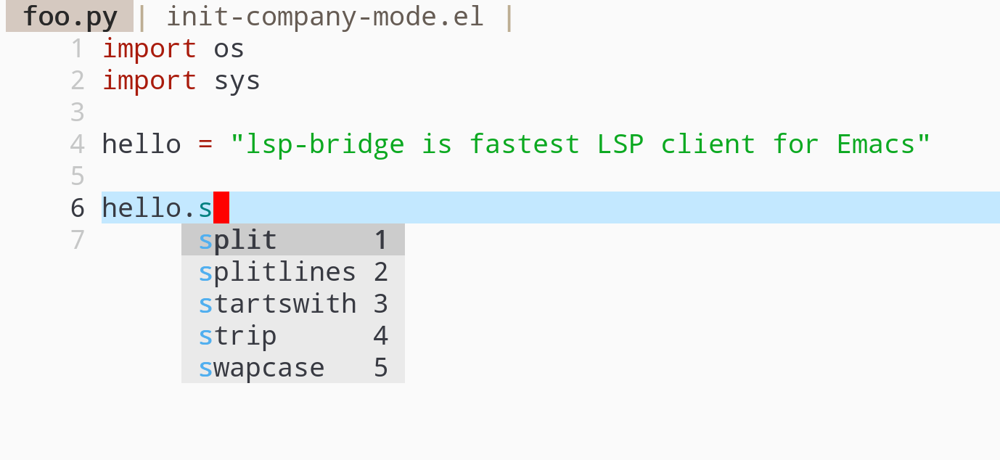
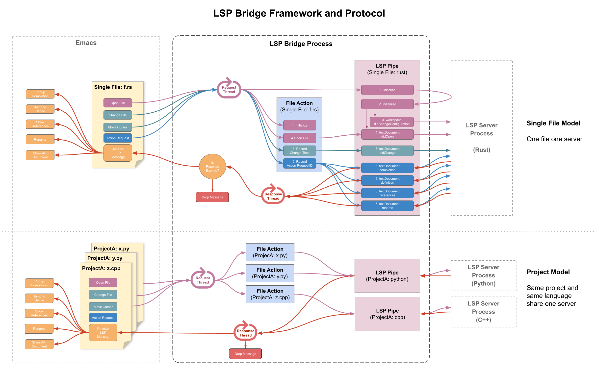

English | [简体中文](./README.zh-CN.md)

# lsp-bridge

The goal of lsp-bridge is to implement the fastest LSP client in the Emacs ecosystem.

Using Python multithreading techniques, lsp-bridge builds a high-speed cache between Emacs and the LSP server, ensuring that Emacs never gets stuck while providing a smooth and seamless code completion experience.



### The video explains the principle of lsp-bridge
| <a href="https://emacsconf.org/2022/talks/lspbridge/">EmacsConf 2022 talk page</a>                               |
| :--------:
| [](https://www.youtube.com/watch?v=vLdqcYafY8w) |


## Installation

1. Install Emacs version 28 or higher.
2. Install Python dependencies: `pip3 install epc orjson sexpdata six` (orjson is optional and provides faster JSON parsing performance based on Rust).
3. Install Elisp dependencies:
+ [posframe](https://github.com/tumashu/posframe)
+ [markdown-mode](https://github.com/jrblevin/markdown-mode)
+ [yasnippet](https://github.com/joaotavora/yasnippet)
+ [acm-terminal](https://github.com/twlz0ne/acm-terminal) (optional, only for terminal user)
4. Download this repository using git clone, and replace the load-path path in the configuration below.
5. Add the following code to your configuration file ~/.emacs:

```elisp
(add-to-list 'load-path "<path-to-lsp-bridge>")

(require 'yasnippet)
(yas-global-mode 1)

(require 'lsp-bridge)
(global-lsp-bridge-mode)
```

Please note that:

1. When using lsp-bridge, please first disable other completion plugins such as lsp-mode, eglot, company, corfu, etc. Lsp-bridge provides a complete solution from completion backend, frontend to multi-backend fusion.
2. When the completion menu pops up, `acm-mode` will be automatically enabled, and when the completion menu disappears, `acm-mode` will be automatically disabled. Please do not manually add `acm-mode` to any mode-hook or manually execute `acm-mode`.

## Usage
Lsp-bridge works out of the box. After installing the corresponding [LSP server](https://github.com/manateelazycat/lsp-bridge#supported-language-servers) and mode plugin for the language, you can start coding directly without any additional settings.

It should be noted that lsp-bridge has three scanning modes:

1. When the `.git` directory is detected (determined by the command `git rev-parse --is-inside-work-tree`), lsp-bridge will scan the entire directory to provide completion.
2. When the `.git` directory is not detected, lsp-bridge only provides single-file completion for the opened file.
3. Custom `lsp-bridge-get-project-path-by-filepath` function, where the input parameter is the path string of the opened file and the output parameter is the project directory path. Lsp-bridge will provide completion based on the output directory path.

## Keymap
| Key            | Command                     | Description                                                                    |
| :------------- | :-------------------------- | :----------------------------------------------------------------------------- |
| Alt + n        | acm-select-next             | Select next candidate                                                          |
| Down           | acm-select-next             | Select next candidate                                                          |
| Alt + p        | acm-select-prev             | Select previous candidate                                                      |
| Up             | acm-select-prev             | Select previous candidate                                                      |
| Alt + ,        | acm-select-last             | Select last candidate                                                          |
| Alt + .        | acm-select-first            | Select first candidate                                                         |
| Ctrl + v       | acm-select-next-page        | Select next page candidate                                                     |
| Alt + v        | acm-select-prev-page        | Select previous page candidate                                                 |
| Ctrl + m       | acm-complete                | Complete completion                                                            |
| Return         | acm-complete                | Complete completion                                                            |
| Tab            | acm-complete                | Complete completion                                                            |
| Alt + h        | acm-complete                | Complete completion                                                            |
| Alt + H        | acm-insert-common           | Insert common part of candidates                                               |
| Alt + u        | acm-filter                  | Filter candidates with overlay string                                          |
| Alt + d        | acm-doc-toggle              | Enable or disable candidate documentation                                      |
| Alt + j        | acm-doc-scroll-up           | Scroll up candidate documentation                                              |
| Alt + k        | acm-doc-scroll-down         | Scroll down candidate documentation                                            |
| Alt + l        | acm-hide                    | Hide completion menu                                                           |
| Ctrl + g       | acm-hide                    | Hide completion menu                                                           |
| Alt + Number   | acm-complete-quick-access   | Selecting candidate quickly, you need enable `acm-enable-quick-access` first   |


## Commands

* `lsp-bridge-find-def`: jump to the definition
* `lsp-bridge-find-def-other-window`: jump to the definition in other-window
* `lsp-bridge-find-def-return`: return to the location before calling `lsp-bridge-find-def`
* `lsp-bridge-find-impl`: jump to the implementation
* `lsp-bridge-find-impl-other-window`: jump to the implementation in other-window
* `lsp-bridge-find-references`: traverse across code references (forked from color-rg.el)
* `lsp-bridge-popup-documentation`: lookup documentation of symbol under the cursor
* `lsp-bridge-popup-documentation-scroll-up`: scroll up popup document.
* `lsp-bridge-popup-documentation-scroll-down`: scroll down popup document.
* `lsp-bridge-rename`: rename symbol under the cursor
* `lsp-bridge-diagnostic-jump-next`: Jump to the next diagnostic position
* `lsp-bridge-diagnostic-jump-prev`: Jump to the previous diagnostic position
* `lsp-bridge-diagnostic-list`: List all diagnostic information
* `lsp-bridge-diagnostic-copy`: Copy the current diagnostic information to the clipboard
* `lsp-bridge-diagnostic-ignore`: Insert comment to ignore the current diagnosis
* `lsp-bridge-code-action`: Popup code action menu, you can pass special `actin-kind` to fix, `action-kind` can use one of "quickfix", "refactor", "refactor.extract", "refactor.inline", "refactor.rewrite", "source", "source.organizeImports", "source.fixAll"
* `lsp-bridge-workspace-list-symbols`: List all symbols in workspace and jump to the symbol definition
* `lsp-bridge-signature-help-fetch`: show signature help in minibuffer manually (move cursor to parameters area will show signature help automatically)
* `lsp-bridge-popup-complete-menu`: Manually popup the completion menu, you only need this command when turn on option `lsp-bride-complete-manually`
* `lsp-bridge-restart-process`: restart lsp-bridge process (only used for development)
* `lsp-bridge-toggle-sdcv-helper`: Switch dictionary completion assistant
* `acm-insert-common`: insert common prefix of candidates
* `acm-doc-scroll-up`: API document window scroll up
* `acm-doc-scroll-down`: API document window scroll down

## LSP server options
* `lsp-bridge-c-lsp-server`: C language server, you can choose `clangd` or` ccls`
* `lsp-bridge-python-lsp-server`: Python language server, you can choose `pyright`, `jedi`, `python-ms`, `pylsp`, `ruff`
* `lsp-bridge-php-lsp-server`: PHP language server, you can choose `intelephense` or `phpactor`
* `lsp-bridge-tex-lsp-server`: LaTeX language server, you can choose `texlab` or` digestif`
* `lsp-bridge-csharp-lsp-server`: C# language server, you can choose `omnisharp-mono` or` omnisharp-dotnet`, note that you need to give **execute permissions** to the OmniSharp file
* `lsp-bridge-python-multi-lsp-server`: Python multi-language servers, you can choose `pyright_ruff`, `jedi_ruff`, `python-ms_ruff`, `pylsp_ruff`

## Options
* `lsp-bridge-python-command`: The path of the python command, if you use `conda`, you may customize this option. Windows platform using `python.exe` rather than `python3`, if lsp-bridge can't work, try set to `python3`
* `lsp-bridge-complete-manually`: Only popup completion menu when user call `lsp-bridge-popup-complete-menu` command, default is nil
* `lsp-bridge-get-workspace-folder`: You need to put multiple project in a `workspace` directory in Java before you can jump function defintion normally. This function can be customized, the function input is the project path and returns the `workspace` directory corresponding
* `lsp-bridge-org-babel-lang-list`: list of language to support org-mode code block completion, nil enable all languages, default is nil
* `lsp-bridge-enable-diagnostics`: code diagnostic, enable by default
* `lsp-bridge-enable-hover-diagnostic`: show diagnostic tooltip when cursor hover diagnostic place, disable by default
* `lsp-bridge-enable-search-words`: index the word of the file, enable by default
* `lsp-bridge-enable-auto-format-code`: automatic format code, disable by default
* `lsp-bridge-enable-signature-help`: show function parameter in minibufer, enable by default
* `lsp-bridge-enable-log`: enable LSP message log, disable by default, only enable this option for development purposes, usually do not turn on this option to avoid affecting performance
* `lsp-bridge-enable-debug`: enable program debugging, disable by default
* `lsp-bridge-disable-backup`: forbidden version manage of emacs, enable by default
* `lsp-bridge-code-action-enable-popup-menu`: enable code action posframe popup menu, enable by default
* `lsp-bridge-diagnostic-fetch-idle`: diagnostic delay, start pulling diagnostic information 0.5 second after stopping typing
* `lsp-bridge-signature-show-function`: The function used for displaying signature info, default show message in minibuffer, set `lsp-bridge-signature-posframe` to show signature info in frame
* `lsp-bridge-completion-popup-predicates`: the predicate function for completion menu, completion menu popup after all the functions pass
* `lsp-bridge-completion-stop-commands`: completion menu will not popup if these commands are executed
* `lsp-bridge-completion-hide-characters`: completion menu will not popup when cursor after those characters
* `lsp-bridge-user-langserver-dir`: the dir where user place langserver configuration file, if the configuration file name in the dir is the same as that in [lsp-bridge/langserver](https://github.com/manateelazycat/lsp-bridge/tree/master/langserver) , lsp-bridge will use the configuration file in this dir
* `lsp-bridge-user-multiserver-dir`: the dir where user place multiserver configuration file, if the configuration file name in the dir is the same as that in [lsp-bridge/multiserver](https://github.com/manateelazycat/lsp-bridge/tree/master/multiserver) , lsp-bridge will use the configuration file in this dir
* `lsp-bridge-symbols-enable-which-func`: Using lsp backend for `which-func`, disable by default
* `lsp-bridge-enable-org-babel`: Using lsp backend for org babel, disable by default
* `acm-frame-background-dark-color`: Menu background color in dark theme
* `acm-frame-background-light-color`: Menu background color in light theme
* `acm-markdown-render-font-height`: The font height of function documentation, default is 130
* `acm-enable-doc`: Whether the complete menu display the help document
* `acm-enable-doc-markdown-render`: Richly render Markdown for completion popups, you can choose `'async`, `t` or `nil`. When set to `'async`, styles are applied asynchronously, choose `t`, styles are applied synchronously and will slow down the completion speed, default is `async`
* `acm-enable-icon`: Whether the complete menu shows the icon, macOS users need to add option `--with-rsvg` to the brew command to install emacs to display SVG icon
* `acm-enable-tabnine`: Enable tabnine support， enable by default，when enable need execute  `lsp-bridge-install-tabnine` command to install TabNine, and it can be used. TabNine will consume huge CPUs, causing your entire computer to be slow. If the computer performance is not good, it is not recommended to enable this option
* `acm-enable-search-file-words`: Whether the complete menu display the word of the file, enable by default
* `acm-enable-quick-access`: Whether the index is displayed behind the icon, you can quickly select the candidate through Alt + Number, disable by default
* `acm-enable-yas`: yasnippet completion, enable by default
* `acm-enable-citre`: Integration with [citre(ctags)](https://github.com/universal-ctags/citre). Enable this to add citre (ctags) backend (disabled by default)
* `acm-doc-frame-max-lines`: Max line number of help documentation, default is 20
* `acm-candidate-match-function`: The complete menu matching algorithm, the algorithm prefix of orderless-* needs to be installed additional [orderless](https://github.com/oantolin/orderless)
* `acm-backend-lsp-candidate-min-length`: The minimum characters to trigger completion, default is 0
* `acm-backend-lsp-enable-auto-import`: automatic insert import code, enable by default
* `acm-backend-lsp-candidate-max-length`: Maximum length of LSP candidate, some language, such as Java, argument list is very long, you can increase the value of this option to see clear argument list
* `acm-backend-yas-candidates-number`: yasnippet display number，2 by default
* `acm-backend-citre-keyword-complete`: Completion is performed according to the keywords of each mode defined by `acm-backend-citre-keywords-alist`, which takes effect only after citre is enabled.
* `acm-backend-search-sdcv-words-dictionary`: StarDict dictionary for word completion, default is `kdic-ec-11w`, you can replace it with StarDict dictionary path, example, if you have dictionary `/usr/share/stardict/dic/stardict-oxford-gb-formated-2.4.2/oxford-gb-formated.ifo`, you need set this value to `/usr/share/stardict/dic/stardict-oxford-gb-formated-2.4.2/oxford-gb-formated`, not include `.ifo` extension.

## Customize language server configuration

The configuration for the LSP server of each language in lsp-bridge is stored in [lsp-bridge/langserver](https://github.com/manateelazycat/lsp-bridge/tree/master/langserver).

In most cases, you can customize the server configuration according to the following priority order:
1. `lsp-bridge-get-single-lang-server-by-project`: A user-defined function that takes project-path and file-path as input parameters and returns the corresponding LSP server string. You can query the names of all LSP servers in the lsp-bridge-single-lang-server-mode-list list. By default, this function returns nil.
2. `lsp-bridge-single-lang-server-extension-list`: Returns the server based on the file extension, for example, when opening a *.wxml file, we will use the wxml LSP server for completion.
3. `lsp-bridge-single-lang-server-mode-list`: Returns the corresponding server based on Emacs's major-mode.

If you are writing JavaScript code, you may need to customize multiple server configurations:
1. `lsp-bridge-get-multi-lang-server-by-project`: A user-defined function that takes project-path and file-path as input parameters and returns the multiple server configuration names. You can search for them in the subdirectory [lsp-bridge/multiserver](https://github.com/manateelazycat/lsp-bridge/tree/master/multiserver).
2. `lsp-bridge-multi-lang-server-extension-list`: Returns multiple server configuration names based on the file extension. For example, when opening a *.vue file, we will use volar_emmet to simultaneously utilize volar and emmet-ls for completion.
3. `lsp-bridge-multi-lang-server-mode-list`: Returns the corresponding multiple server configuration names based on Emacs's major-mode.

For example, we can enable the Deno LSP server for Deno scripts with the following configuration:

```elisp
(setq lsp-bridge-get-single-lang-server-by-project
      (lambda (project-path filepath)
        ;; If typescript file include deno.land url, then use Deno LSP server.
        (save-excursion
          (when (string-equal (file-name-extension filepath) "ts")
            (dolist (buf (buffer-list))
              (when (string-equal (buffer-file-name buf) filepath)
                (with-current-buffer buf
                  (goto-char (point-min))
                  (when (search-forward-regexp (regexp-quote "from \"https://deno.land") nil t)
                    (return "deno")))))))))
```

## Customize language server configuration file
Copy the configuration files in [lsp-bridge/langserver](https://github.com/manateelazycat/lsp-bridge/tree/master/langserver) or [lsp-bridge/multiserver](https://github.com/manateelazycat/lsp-bridge/tree/master/multiserver) to lsp-bridge-user-langserver-dir or lsp-bridge-user-multiserver-dir for customization. Lsp-bridge will prioritize reading the configuration files in lsp-bridge-user-langserver-dir or lsp-bridge-user-multiserver-dir.

We can set the value of lsp-bridge-user-langserver-dir or lsp-bridge-user-multiserver-dir before starting lsp-bridge-mode to achieve different project-specific configuration files.


```elisp
(defun enable-lsp-bridge()
  (when-let* ((project (project-current))
              (project-root (nth 2 project)))
    (setq-local lsp-bridge-user-langserver-dir project-root
                lsp-bridge-user-multiserver-dir project-root))
  (lsp-bridge-mode))
```


## Add support for new language?

1. Create a configuration file in the lsp-bridge/langserver directory. For example, `pyright.json` is the configuration file for the pyright server (use `pyright_windows.json` for Windows and `pyright_darwin.json` for macOS).
2. Add `(mode . server_name)` to the `lsp-bridge-single-lang-server-mode-list` option in the lsp-bridge.el file, for example, `(python-mode . "pyright")`.
3. Add a new mode-hook to the `lsp-bridge-default-mode-hooks` option in the lsp-bridge.el file.
4. Add a new indentation variable to the `lsp-bridge-formatting-indent-alist` option in the lsp-bridge.el file.

We welcome patches to help us support more LSP servers. Thank you for your help!

## Supported language servers

You need to install the LSP server corresponding to each programming language, then lsp-bridge can provide code completion service.

| LSP Server                                                                                           | Language                                  | Note                                                                                                                                                                          |
| :--------------------------------------------------------------------------------------------------- | :---------------------------------------- | :------------------------------------------------------------------------------------------------------------------------------------------------------------------------------------------------------------------------------------------------------------------ |
| [clangd](https://github.com/clangd/clangd)                                                           | C, C++, Object-C                          | need you config compile_commands.json first                                                                                                                                                                              |
| [ccls](https://github.com/MaskRay/ccls)                                                              | C, C++, Object-C                          | `lsp-bridge-c-lsp-server` set to` ccls`, need you config compile_commands.json first                                                                                                     |
| [pyright](https://github.com/microsoft/pyright)                                                      | Python                                    | `lsp-bridge-python-lsp-server` set to `pyright`, `pyright-background-analysis` is faster sometimes, but it can't response diagnostic informations                             |
| [jedi](https://github.com/pappasam/jedi-language-server)                                             | Python                                    | `lsp-bridge-python-lsp-server` set to `jedi`                                                                                                                                  |
| [python-ms](https://github.com/microsoft/python-language-server)                                     | Python                                    | Legacy language server for Python2                                                                                                                                            |
| [pylsp](https://github.com/python-lsp/python-lsp-server)                                             | Python                                    | `lsp-bridge-python-lsp-server` set to `pylsp`                                                                                                                                 |
| [ruff](https://github.com/charliermarsh/ruff-lsp)                                                    | Python                                    | `pip install ruff-lsp`,`lsp-bridge-python-lsp-server` is set to `ruff`, which only has the function of linter. If you need to complete the functions, install other Python language servers, and set the `lsp-bridge-python-multi-lsp-server` to `[LSP NAME]_ruff` |
| [solargraph](https://github.com/castwide/solargraph)                                                 | Ruby                                      |                                                                                                                                                                               |
| [rust-analyzer](https://github.com/rust-lang/rust-analyzer)                                          | Rust                                      |                                                                                                                                                                               |
| [elixirLS](https://github.com/elixir-lsp/elixir-ls)                                                  | Elixir                                    | Please ensure that the `elixir-ls` release directory is in your system PATH at first                                                                                          |
| [gopls](https://github.com/golang/tools/tree/master/gopls)                                           | Go                                        | Make sure install [go-mode](https://github.com/dominikh/go-mode.el) and gopls in PATH, please do `ln -s ~/go/bin/gopls ~/.local/bin`, and do `go mod init` first              |
| [hls](https://github.com/haskell/haskell-language-server)                                            | Haskell                                   |                                                                                                                                                                               |
| [dart-analysis-server](https://github.com/dart-lang/sdk/tree/master/pkg/analysis_server)             | Dart                                      |                                                                                                                                                                               |
| [metals](https://scalameta.org/metals/)                                                              | Scala                                     |                                                                                                                                                                               |
| [typescript](https://github.com/typescript-language-server/typescript-language-server)               | Typescript, Javascript                    |                                                                                                                                                                               |
| [ocamllsp](https://github.com/ocaml/ocaml-lsp)                                                       | Ocaml                                     |                                                                                                                                                                               |
| [erlang-ls](https://github.com/erlang-ls/erlang_ls)                                                  | Erlang                                    |                                                                                                                                                                               |
| [texlab](https://github.com/latex-lsp/texlab)                                                        | Latex                                     |                                                                                                                                                                               |
| [eclipse.jdt.ls](https://projects.eclipse.org/projects/eclipse.jdt.ls)                               | Java                                      | Please ensure that `org.eclipse.jdt.ls.product/target/repository/bin` is in your system PATH at first                                                                         |
| [clojure-lsp](https://github.com/clojure-lsp/clojure-lsp)                                            | Clojure                                   | If you use `homebrew` , please ensure install `clojure-lsp/brew/clojure-lsp-native` [clojure-lsp-native](https://clojure-lsp.io/installation/#homebrew-macos-and-linux)       |
| [bash-language-server](https://github.com/bash-lsp/bash-language-server)                             | Bash                                      |                                                                                                                                                                               |
| [volar](https://github.com/johnsoncodehk/volar)                                                      | Vue                                       | `npm install -g typescript @volar/vue-language-server`                                                                                                                        |
| [sumneko](https://github.com/sumneko/lua-language-server)                                            | Lua                                       | Please ensure `bin` under sumneko installation is in your system PATH at first                                                                                                |
| [wxml-language-server](https://github.com/chemzqm/wxml-languageserver)                               | Wxml                                      |                                                                                                                                                                               |
| [vscode-html-language-server](https://github.com/hrsh7th/vscode-langservers-extracted)               | HTML                                      | `npm i -g vscode-langservers-extracted`                                                                                                                                       |
| [vscode-css-language-server](https://github.com/hrsh7th/vscode-langservers-extracted)                | CSS                                       | `npm i -g vscode-langservers-extracted`                                                                                                                                       |
| [vscode-eslint-language-server](https://github.com/hrsh7th/vscode-langservers-extracted)             | JavaScript                                | `npm i -g vscode-langservers-extracted`                                                                                                                                       |
| [vscode-json-language-server](https://github.com/hrsh7th/vscode-langservers-extracted)               | JSON                                      | `npm i -g vscode-langservers-extracted`                                                                                                                                       |
| [elm-language-server](https://github.com/elm-tooling/elm-language-server)                            | Elm                                       |                                                                                                                                                                               |
| [intelephense](https://github.com/bmewburn/vscode-intelephense)                                      | PHP                                       |                                                                                                                                                                               |
| [Phpactor](https://github.com/phpactor/phpactor)                                                     | PHP                                       | lsp-brige-php-lsp-server set to `phpactor`                                                                                                                                    |
| [yaml-language-server](https://github.com/redhat-developer/yaml-language-server)                     | Yaml                                      | `npm install -g yaml-language-server`                                                                                                                                         |
| [zls](https://github.com/zigtools/zls)                                                               | Zig                                       | Execute `zls config` to generate configuration for zls. see [Configuration Options](https://github.com/zigtools/zls#configuration-options)                                    |
| [groovy-language-server](https://github.com/GroovyLanguageServer/groovy-language-server)             | Groovy                                    | Create a script "groovy-language-server" in PATH, with `$JAVA_HOME/bin/java -jar <path>/groovy-language-server-all.jar`                                                       |
| [docker-language-server](https://github.com/rcjsuen/dockerfile-language-server-nodejs)               | Dockerfiles                               |                                                                                                                                                                               |
| [serve-d](https://github.com/Pure-D/serve-d)                                                         | D                                         | serve-d does not support single file mode, please init .git repository under project root at first or custom `lsp-bridge-get-project-path-by-filepath` function               |
| [fortls](https://github.com/gnikit/fortls)                                                           | Fortran                                   |                                                                                                                                                                               |
| [emmet-ls](https://github.com/aca/emmet-ls)                                                          | HTML, JavaScript, CSS, SASS, SCSS, LESS   |                                                                                                                                                                               |
| [rnix-lsp](https://github.com/nix-community/rnix-lsp)                                                | Nix                                       |                                                                                                                                                                               |
| [texlab](https://github.com/latex-lsp/texlab)                                                        | Latex                                     | `lsp-bridge-tex-lsp-server` set to `texlab`                                                                                                                                   |
| [digestif](https://github.com/astoff/digestif)                                                       | Latex                                     | `lsp-bridge-tex-lsp-server` set to `digestif`                                                                                                                                 |
| [rlanguageserver](https://github.com/REditorSupport/languageserver)                                  | R                                         |                                                                                                                                                                               |
| [graphql-lsp](https://github.com/graphql/graphiql/tree/main/packages/graphql-language-service-cli)   | GraphQL                                   |                                                                                                                                                                               |
| [cmake-language-server](https://github.com/regen100/cmake-language-server)                           | Cmake                                     | `pip install cmake-language-server`                                                                                                                                           |
| [ds-pinyin](https://github.com/iamcco/ds-pinyin-lsp)                                                 | Org-mode                                  | `cargo install ds-pinyin-lsp`, download dict.db3 of ds-pinyin, and save to ~/.emacs.d/ds-pinyin/ directory, then turn on option `lsp-bridge-use-ds-pinyin-in-org-mode`        |
| [Wen](https://github.com/metaescape/Wen)                                                             | Org-mode                                  | `pip install pygls pypinyin`, then turn on option `lsp-bridge-use-wenls-in-org-mode`                                                                                          |
| [sourcekit-lsp](https://github.com/apple/sourcekit-lsp)                                              | Swift                                     | The SourceKit-LSP server is included with the Swift toolchain.                                                                                                                |
| [omnisharp-mono](https://github.com/OmniSharp/omnisharp-roslyn)                                      | C#                                        | OmniSharp is a .NET development platform based on Roslyn workspaces. use `M-x lsp-bridge-install-omnisharp` to install it. `lsp-bridge-csharp-lsp-server` set to `omnisharp-mono` |
| [omnisharp-dotnet](https://github.com/OmniSharp/omnisharp-roslyn)                                    | C#                                        | OmniSharp is a .NET development platform based on Roslyn workspaces. use `M-x lsp-bridge-install-omnisharp` to install it. `lsp-bridge-csharp-lsp-server` set to `omnisharp-dotnet` (6.0) |
| [deno](https://deno.land)                                                                            | Deno                                      | Deno runtime use TypeScript as source code, you need customize option `lsp-bridge-get-single-lang-server-by-project` that return result "deno" when `project-path` match Deno project. |
| [ansible-language-server](https://github.com/ansible/ansible-language-server)                        | Ansible                                   | Ansible uses YAML as source code, you'll need to customize `lsp-bridge-get-single-lang-server-by-project` to return "ansible-language-server".                                |
| [astro](https://github.com/withastro/language-tools/tree/main/packages/language-server)              | Astro                                     | `npm i -g @astrojs/language-server`                                                                                                                                           |
| [qmlls](https://github.com/qt/qtdeclarative/tree/dev/tools/qmlls)                                    | QML                                       | The `qmlls` binary should be part of the normal Qt packages since Qt 6.3.0 Ensure that the directory  of `qmlls` binary file is in PATH                                       |
| [kotlin-language-server](https://github.com/fwcd/kotlin-language-server)                             | Kotlin                                    |                                                                                                                                                                               |
| [vhdl-tool](https://www.vhdltool.com)                                                                | VHDL                                |                                                                                                                                                                               |
| [julials](https://github.com/julia-vscode/LanguageServer.jl)                                         | Julia                                |                                                                                                                                                                               |
## Join development

The following is the framework of lsp-bridge:



The following is the directory structure of the lsp-bridge project:

| File                         | Explanation                                                                                                                                                                  |
| :-----------------------     | :--------------------------------------------------------------------------------------------------------------------------------------------------                          |
| lsp-bridge.el                | Elisp main logic part that provides custom options and elisp functions for python sub-process calls like code jumping, renaming, etc.                                        |
| lsp-bridge-epc.el            | Communicating with lsp-bridge python sub-process, which mainly implements elisp IPC to connect to python EPC for data serialization, sending, receiving, and deserialization |
| lsp-bridge-call-hierarchy.el | Show call hierarchy in popup frame.                                                                                                                                          |
| lsp-bridge-code-action.el    | Code action functions                                                                                                                                                        |
| lsp-bridge-diagnostic.el     | Diagnostic functions                                                                                                                                                         |
| lsp-bridge-ref.el            | Framework of code referencing, providing references viewing, batch renames, regex filtering of reference results, etc. The core code is forked from color-rg.el              |
| lsp-bridge-jdtls.el          | Provide java language third-party library jumping function                                                                                                                   |
| lsp-bridge-lsp-installer.el  | Install TabNine and Omnisharp                                                                                                                                                |
| lsp-bridge.py                | Python main logic part that provides event loop, message scheduling and status management                                                                                    |
| acm/acm.el                   | Asynchronous completion menu, specially designed for lsp-bridge backend, supports LSP, elisp, words, TabNine and other backend                                               |
| core/fileaction.py           | Tracking the status of each file, processing LSP response messages, calling Emacs elisp function                                                                             |
| core/lspserver.py            | LSP message processing module, mainly to analyze, send and receive LSP messages, and ensure that the sequence of LSP requests conforms with the LSP protocol specification   |
| core/utils.py                | Utility functions of convenience for each module call                                                                                                                        |
| core/mergedeep.py            | JSON information merger is mainly used to send custom options to LSP server                                                                                                  |
| core/hanlder/                | The implementation of sending and receiving LSP message, where __init__.py is a base class                                                                                   |
| langserver                   | The configurations of the LSP servers, each server corresponding to a JSON file that defines the name of the server, language ID, starting command, options, etc.            |

Please read below articles first:
* [LSP Specification](https://microsoft.github.io/language-server-protocol/specifications/lsp/3.17/specification/)
* [The Design of lsp-bridge](https://manateelazycat.github.io/emacs/2022/05/12/lsp-bridge.html)
* [Why lsp-bridge not use capf](https://manateelazycat.github.io/emacs/2022/06/26/why-lsp-bridge-not-use-capf.html)
* [lsp-bridge Wiki](https://github.com/manateelazycat/lsp-bridge/wiki)

Then turn on develop option ```lsp-bridge-enable-log``` and happy hacking! ;)


## Report bug

For some common problems, please read [Wiki](https://github.com/manateelazycat/lsp-bridge/wiki) first.

Please use `emacs -q` and load a minimal setup with only lsp-bridge to verify that the bug is reproducible. If `emacs -q` works fine, probably something is wrong with your Emacs config.

If the problem still exists, please report it [here](https://github.com/manateelazycat/lsp-bridge/issues/new) with `*lsp-bridge*` buffer content, it contains many clues that can help us locate the problem faster.

* If you get a segfault error, please use the following way to collect crash information:
  1. Install gdb and turn on option `lsp-bridge-enable-debug`
  2. Use the command `lsp-bridge-restart-process` to restart the `LSP-BRIDGE` process
  3. Send issue with `*lsp-bridge*` buffer content when next crash

* If you get other errors, please use the following way to collection information:
  1. turn on option `lsp-bridge-enable-log`
  2. Use the command `lsp-bridge-restart-process` to restart the `LSP-BRIDGE` process
  3. Send issue with `*lsp-bridge*` buffer content

## Contributor

<a href = "https://github.com/manateelazycat/lsp-bridge/graphs/contributors">
  
</a>
