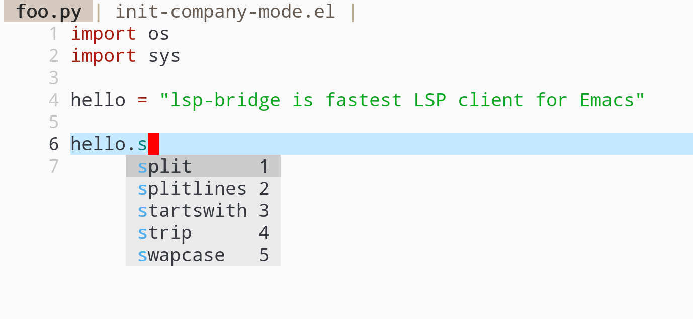
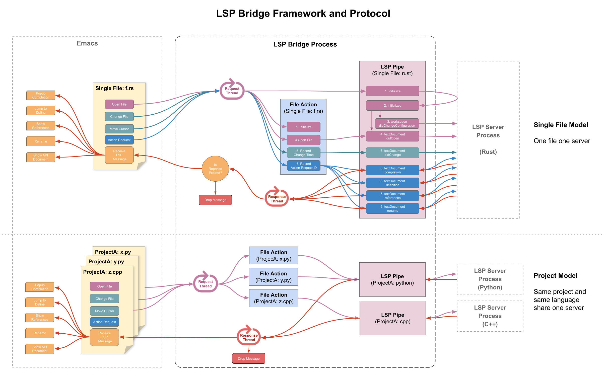
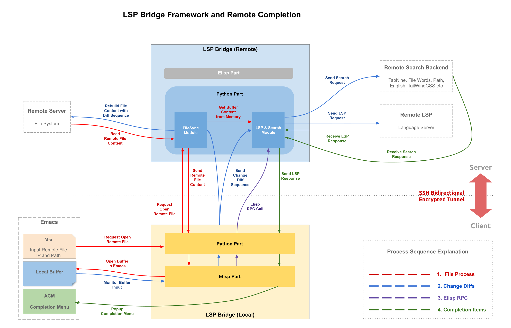

[English](./README.md) | 简体中文

<hr>
  <a href="https://github.com/manateelazycat/lsp-bridge?tab=readme-ov-file#installation"><strong>安装</strong></a> •
  <a href="https://github.com/manateelazycat/lsp-bridge?tab=readme-ov-file#supported-language-servers"><strong>支持的语言列表</strong></a> •
  <a href="https://github.com/manateelazycat/lsp-bridge?tab=readme-ov-file#keymap"><strong>按键</strong></a> •
  <a href="https://github.com/manateelazycat/lsp-bridge?tab=readme-ov-file#lsp-server-options"><strong>自定义选项</strong></a> •
  <a href="https://github.com/manateelazycat/lsp-bridge?tab=readme-ov-file#join-development"><strong>加入开发</strong></a>
<hr>

# lsp-bridge

lsp-bridge 的目标是使用多线程技术实现 Emacs 生态中速度最快的 LSP 客户端， 开箱即用的设计理念， 节省你自己折腾的时间， 时间就是金钱。

lsp-bridge 的优势：
1. 速度超快： 把 LSP 的请求等待和数据分析都隔离到外部进程， 不会因为 LSP Server 返回延迟或大量数据触发 GC 而卡住 Emacs
2. 远程补全： 内置远程服务器代码补全， 支持密码、 公钥等多种登录方式， 支持 tramp 协议， 支持 SSH 多级堡垒机跳转, 支持 Docker
3. 开箱即用： 安装后立即可以使用， 不需要额外的配置， 不需要自己折腾补全前端、 补全后端以及多后端融合等配置, org-mode 的 src-block 也能补全
4. 多服务器融合： 只需要一个简单的 JSON 即可混合多个 LSP Server 为同一个文件提供服务， 例如 Python， Pyright 提供代码补全， Ruff 提供诊断和格式化
5. 灵活的自定义： 自定义 LSP Server 选项只需要一个 JSON 文件即可， 简单的几行规则就可以让不同的项目使用不同 JSON 配置



### 视频讲解 lsp-bridge 的原理

| <a href="https://emacsconf.org/2022/talks/lspbridge/">EmacsConf 2022 演讲页面</a> |
| :--------:
| [](https://www.youtube.com/watch?v=vLdqcYafY8w) |

## 安装

1. 安装 Emacs 28 及以上版本
2. 安装 Python 依赖: `pip3 install epc orjson sexpdata six setuptools paramiko rapidfuzz watchdog packaging` (orjson 是可选的， orjson 基于 Rust， 提供更快的 JSON 解析性能)
   - 如果你已经安装了 [uv](https://docs.astral.sh/uv)，可以使用仓库中提供的 `python-lsp-bridge` 包装脚本。请将其**创建符号链接**（不要复制）到你的 PATH 路径下的目录。lsp-bridge 会默认使用这个选项。
3. 安装 Elisp 依赖: [markdown-mode](https://github.com/jrblevin/markdown-mode), [yasnippet](https://github.com/joaotavora/yasnippet)
4. 用 `git clone` 下载此仓库， 并替换下面配置中的 load-path 路径
5. 把下面代码加入到你的配置文件 ~/.emacs 中：

```elisp
(add-to-list 'load-path "<path-to-lsp-bridge>")

(require 'yasnippet)
(yas-global-mode 1)

(require 'lsp-bridge)
(global-lsp-bridge-mode)
```

备注： 在终端下补全请安装编译 Emacs 最新版， 以支持 tty-child-frames

* 如果你使用 straight 来安装， 应该用下面的配置来安装：

```elisp
(use-package lsp-bridge
  :straight '(lsp-bridge :type git :host github :repo "manateelazycat/lsp-bridge"
            :files (:defaults "*.el" "*.py" "acm" "core" "langserver" "multiserver" "resources")
            :build (:not compile))
  :init
  (global-lsp-bridge-mode))
```

* 如果你使用 `doom-emacs`

添加下面配置到文件 `packages.el`

``` elisp
(when (package! lsp-bridge
        :recipe (:host github
                 :repo "manateelazycat/lsp-bridge"
                 :branch "master"
                 :files ("*.el" "*.py" "acm" "core" "langserver" "multiserver" "resources")
                 ;; do not perform byte compilation or native compilation for lsp-bridge
                 :build (:not compile)))
  (package! markdown-mode)
  (package! yasnippet))
```

添加下面配置到文件 `config.el`

``` elisp
(use-package! lsp-bridge
  :config
  (global-lsp-bridge-mode))
```

并执行命令 `doom sync` 进行安装。

### 如果你安装以后不能正常工作， 请先阅读[反馈问题](https://github.com/manateelazycat/lsp-bridge/blob/master/README.zh-CN.md#%E5%8F%8D%E9%A6%88%E9%97%AE%E9%A2%98)

请注意:

1. 使用 lsp-bridge 时， 请先关闭其他补全插件， 比如 lsp-mode, eglot, company, corfu 等等， lsp-bridge 提供从补全后端、 补全前端到多后端融合的全套解决方案。
2. lsp-bridge 除了提供 LSP 补全以外， 也提供了很多非 LSP 的补全后端， 包括 capf、 文件单词、 路径、 Yas/Tempel、 TabNine、 Codeium、 Copilot、 Tabby, Citre、 Ctags, Org roam 等补全后端， 如果你期望在某个模式提供这些补全， 请把对应的模式添加到 `lsp-bridge-default-mode-hooks`, 定义补全顺序请查看 `acm-backend-order`
3. 请不要对 lsp-bridge 执行 ```byte compile``` 或者 ```native comp```， 会导致升级后， compile 后的版本 API 和最新版不一样， lsp-bridge 多线程设计， 不需要 compile 来加速

## 本地使用

lsp-bridge 开箱即用， 安装好语言对应的 [LSP 服务器](https://github.com/manateelazycat/lsp-bridge/blob/master/README.zh-CN.md#%E5%B7%B2%E7%BB%8F%E6%94%AF%E6%8C%81%E7%9A%84%E8%AF%AD%E8%A8%80%E6%9C%8D%E5%8A%A1%E5%99%A8)和模式插件以后， 直接写代码即可， 不需要额外的设置。

需要注意的是 lsp-bridge 有三种扫描模式：

1. 通过向上搜索 `.git` 或 `.dir-locals.el` 文件来确定项目的 root 目录， 从而对整个项目目录提供补全
2. 没有找到 `.git` 或 `.dir-locals.el` 文件时， lsp-bridge 只会对打开的文件提供单文件补全
3. 也可以通过自定义 `lsp-bridge-get-project-path-by-filepath` 函数来告诉 lsp-bridge 项目的根目录， 这个函数输入参数是打开文件的路径字符串， 输出参数是项目目录路径

## 远程使用

### 远程 SSH 服务器
`lsp-bridge`能像 VSCode 一样在远程服务器文件上进行代码语法补全。 配置步骤如下：

1. 在远程服务器安装 lsp-bridge 和相应的 LSP Server
2. 启动 lsp-bridge： `python3 lsp-bridge/lsp_bridge.py`
3. 用`lsp-bridge-open-remote-file`命令打开文件， 输入用户名、 IP、 SSH 端口(默认 22) 和路径， 例如`user@ip:[ssh_port]:/path/file`
4. 启用`lsp-bridge-enable-with-tramp`选项可以直接打开 tramp 文件， 并用 lsp-bridge 的高效算法代替 tramp， 实现流畅补全。 如果 tramp 中 host 是在 `~/.ssh/config` 定义的， 那么 lsp-birdge 可以同步下列选项用于远程连接:
   - HostName(必须是 ip 形式的 hostname， domain 形式的 hostname 会导致问题)
   - User
   - Port
   - GSSAPIAuthentication
   - ProxyCommand(当前只支持用 ProxyCommand 选项， 不支持 ProxyJump 选项)
5. `(setq lsp-bridge-remote-start-automatically t)` 可以在打开 tramp 文件时自动启动远程机器(需要支持 bash)上的 lsp_bridge.py 进程， 退出 emacs 时也会自动关闭。 使用该功能时需要正确设置下列选项：
   - lsp-bridge-remote-python-command: 远程机器上的 python 命令名
   - lsp-bridge-remote-python-file: 远程机器上 lsp_bridge.py 的路经
   - lsp-bridge-remote-log: 远程机器上 lsp_bridge.py 的 log 输出路经


远程补全原理：

1. 通过 SSH 认证登录服务器， 访问和编辑文件
2. 编辑远程文件副本时， 会实时发送 diff 序列到 lsp-bridge， 服务端用这些序列重建文件， 并由远端的 LSP Server 计算补全数据
3. 远端 LSP Server 将补全数据回传本地由 Emacs 显示补全菜单

注意：

1. 若补全菜单未显示， 检查远程服务器的`lsp_bridge.py`输出， 可能是 LSP Server 未完全安装
2. lsp-bridge 会用`~/.ssh`的第一个 *.pub 文件作为登录凭证。 如果公钥登录失败， 会要求输入密码。 lsp-bridge 不会存储密码， 建议用公钥登录以避免重复输入密码
3. 你需要在远程服务器完整的下载整个 lsp-bridge git 仓库， 并切换到 lsp-bridge 目录来启动 `lsp_bridge.py`， `lsp_bridge.py` 需要其他文件来保证正常工作， 不能只把 `lsp_bridge.py` 文件拷贝到其他目录来启动
4. 如果 tramp 文件出现 lsp-bridge 连接错误， 可以执行 `lsp-bridge-tramp-show-hostnames` 函数， 然后检查输出的 host 配置选项是否符合预期
5. 如果你遇到 `remote file ... is updating info... skip call ...` 类似错误， 请确保用 SSH 的方式打开文件， 已经发现 ivy-mode 会干扰 `C-x C-f`

### 本地开发容器

`lsp-bridge` 现在支持在 `devcontainer` 上的文件补完， 类似于 VSCode。 这是通过使用 [devcontainer-feature-emacs-lsp-bridge](https://github.com/nohzafk/devcontainer-feature-emacs-lsp-bridge) 实现的。

以下是一个完整的配置示例：

#### devcontainer.json
`.devcontainer/devcontainer.json`

```json
{
    "name": "Ubuntu",
    // Your base image
    "image": "mcr.microsoft.com/devcontainers/base:jammy",
    // Features to add to the dev container. More info: https://containers.dev/features.
    "features": {
        "ghcr.io/nohzafk/devcontainer-feature-emacs-lsp-bridge/gleam:latest": {}
    },
    "forwardPorts": [
        9997,
        9998,
        9999
    ],
    // More info: https://aka.ms/dev-containers-non-root.
    "remoteUser": "vscode"
}
```

启动开发容器， 并使用 `file-find` `/docker:user@container:/path/to/file` 打开文件。

更多详细信息， 请参阅 [devcontainer-feature-emacs-lsp-bridge](https://github.com/nohzafk/devcontainer-feature-emacs-lsp-bridge)。

如果您使用 `apheleia` 作为 Formatter， `lsp-bridge` 现在支持自动格式化 devcontainer 上的文件。

```elisp
(use-package! apheleia
  :config
  ;; which formatter to use
  (setf (alist-get 'python-mode apheleia-mode-alist) 'ruff)
  (setf (alist-get 'python-ts-mode apheleia-mode-alist) 'ruff)
  ;; don't mess up with lsp-mode
  (setq +format-with-lsp nil)
  ;; run the formatter inside container
  (setq apheleia-remote-algorithm 'remote))
```

## 按键

| 按键         | 命令                      | 备注                                                     |
|:-------------|:--------------------------|:---------------------------------------------------------|
| Alt + n      | acm-select-next           | 选择下一个候选词                                         |
| Down         | acm-select-next           | 选择下一个候选词                                         |
| Alt + p      | acm-select-prev           | 选择上一个候选词                                         |
| Up           | acm-select-prev           | 选择上一个候选词                                         |
| Alt + ,      | acm-select-last           | 选择最后一个候选词                                       |
| Alt + .      | acm-select-first          | 选择第一个候选词                                         |
| Ctrl + v     | acm-select-next-page      | 向下滚动候选菜单                                         |
| Alt + v      | acm-select-prev-page      | 向上滚动候选菜单                                         |
| Ctrl + m     | acm-complete              | 完成补全                                                 |
| Return       | acm-complete              | 完成补全                                                 |
| Tab          | acm-complete              | 完成补全                                                 |
| Alt + h      | acm-complete              | 完成补全                                                 |
| Alt + H      | acm-insert-common         | 插入候选词共有部分                                       |
| Alt + u      | acm-filter                | 对候选词做二次过滤， 类似其他补全前端的模糊搜索                |
| Alt + d      | acm-doc-toggle            | 开启或关闭候选词文档                                     |
| Alt + j      | acm-doc-scroll-up         | 向下滚动候选词文档                                       |
| Alt + k      | acm-doc-scroll-down       | 向上滚动候选词文档                                       |
| Alt + l      | acm-hide                  | 隐藏补全窗口                                             |
| Ctrl + g     | acm-hide                  | 隐藏补全窗口                                             |
| Alt + 数字键 | acm-complete-quick-access | 快速选择候选词， 需要开启 `acm-enable-quick-access` 选项 |
| 数字键       | acm-complete-quick-access | (更加)快速选择候选词， 需要同时开启 `acm-enable-quick-access` 和 `acm-quick-access-use-number-select` |

## 命令

- `lsp-bridge-find-def`: 跳转到定义位置
- `lsp-bridge-find-def-other-window`: 在其他窗口跳转到定义位置
- `lsp-bridge-find-def-return`: 返回跳转之前的位置
- `lsp-bridge-find-impl`: 跳转到接口实现位置
- `lsp-bridge-find-impl-other-window`: 在其他窗口跳转到接口实现位置
- `lsp-bridge-find-type-def`: 跳转到类型定义位置
- `lsp-bridge-find-type-def-other-window`: 在其他窗口跳转到类型定义位置
- `lsp-bridge-find-references`: 查看代码引用
- `lsp-bridge-popup-documentation`: 查看光标处的文档
- `lsp-bridge-popup-documentation-scroll-up`: 文档窗口向上滚动
- `lsp-bridge-popup-documentation-scroll-down`: 文档窗口向下滚动
- `lsp-bridge-show-documentation`: 查看光标处的文档, 但是是用 Buffer 来显示
- `lsp-bridge-rename`: 重命名
- `lsp-bridge-diagnostic-jump-next`: 跳转到下一个诊断位置
- `lsp-bridge-diagnostic-jump-prev`: 跳转到上一个诊断位置
- `lsp-bridge-diagnostic-list`: 列出所有诊断信息
- `lsp-bridge-diagnostic-copy`: 拷贝当前诊断信息到剪切板
- `lsp-bridge-code-action`: 弹出代码修复菜单, 也可以指需要修复的代码动作类型: "quickfix", "refactor", "refactor.extract", "refactor.inline", "refactor.rewrite", "source", "source.organizeImports", "source.fixAll"
- `lsp-bridge-workspace-list-symbol-at-point`: 查找光标下符号的定义
- `lsp-bridge-workspace-list-symbols`: 列出工作区所有符号， 并跳转到符号定义
- `lsp-bridge-signature-help-fetch`: 在 minibuffer 显示参数信息
- `lsp-bridge-popup-complete-menu`: 手动弹出补全菜单， 只有当打开 `lsp-bridge-complete-manually` 选项才需要使用这个命令
- `lsp-bridge-restart-process`: 重启 lsp-bridge 进程 (一般只有开发者才需要这个功能)
- `lsp-bridge-toggle-sdcv-helper`: 切换字典助手补全
- `lsp-bridge-peek`: 在 peek window 中展示光标处的定义和引用
- `lsp-bridge-peek-abort`: 关闭 peek window (默认绑定到 `C-g`)
- `lsp-bridge-peek-list-next-line`: 选择下一个定义或引用 (默认绑定到 `M-S-n` )
- `lsp-bridge-peek-list-prev-line`: 选择上一个定义或引用 (默认绑定到 `M-S-p` )
- `lsp-bridge-peek-file-content-next-line`: 将 peek window 中的文件内容向下滚动一行 (默认绑定到 `M-n` )
- `lsp-bridge-peek-file-content-prev-line`: 将 peek window 中的文件内容向上滚动一行 (默认绑定到 `M-p` )
- `lsp-bridge-peek-jump`: 跳转到定义或引用所在处 (默认绑定到 `M-l j` )
- `lsp-bridge-peek-jump-back`: 跳转到原来的位置 (默认绑定到 `M-l b` )
- `lsp-bridge-peek-through`: 选择 peek window 中的一个符号进行查看
- `lsp-bridge-peek-tree-previous-branch`: 选择上一个浏览历史上同级的分支 (默认绑定到 `<up>` )
- `lsp-bridge-peek-tree-next-branch`: 选择下一个浏览历史上同级的分支 (默认绑定到 `<down>` )
- `lsp-bridge-peek-tree-previous-node`: 选择浏览历史上一级节点 (默认绑定到 `<left>` )
- `lsp-bridge-peek-tree-next-node`: 选择浏览历史上下一级节点 (默认绑定到 `<right>` )
- `lsp-bridge-indent-left`: 根据 `lsp-bridge-formatting-indent-alist` 定义的缩进值, 向左缩进刚刚粘贴的文本
- `lsp-bridge-indent-right`: 根据 `lsp-bridge-formatting-indent-alist` 定义的缩进值, 向右缩进刚刚粘贴的文本
- `lsp-bridge-semantic-tokens-mode`: 开启或者关闭语义符号高亮， 自定义请参考 [Semantic Tokens Wiki](https://github.com/manateelazycat/lsp-bridge/wiki/Semantic-Tokens-%5B%E7%AE%80%E4%BD%93%E4%B8%AD%E6%96%87%E7%89%88%5D)
- `lsp-bridge-breadcrumb-mode`: 开启顶部 breadcrumb 栏

## LSP 服务器选项
lsp-bridge 针对许多语言都提供 2 个以上的语言服务器支持， 您可以通过定制下面的选项来选择你喜欢的语言服务器:

- `lsp-bridge-c-lsp-server`: C 语言的服务器， 可以选择`clangd`或者`ccls`
- `lsp-bridge-elixir-lsp-server`: Elixir 语言的服务器， 可以选择`elixirLS`,`lexical`或者`nextls`
- `lsp-bridge-python-lsp-server`: Python 语言的服务器， 可以选择 `basedpyright`, `pyright`, `jedi`, `python-ms`, `pylsp`, `ruff`, 需要注意的是, `lsp-bridge-multi-lang-server-mode-list` 的优先级高于 `lsp-bridge-single-lang-server-mode-list`, 如果你只想使用单服务器， 请先去掉 `lsp-bridge-multi-lang-server-mode-list` 中 python-mode 的设置
- `lsp-bridge-ruby-lsp-server`: Ruby 语言的服务器， 可以选择 `solargraph`, `ruby-lsp`
- `lsp-bridge-php-lsp-server`: PHP 语言的服务器， 可以选择`intelephense`或者`phpactor`
- `lsp-bridge-tex-lsp-server`: LaTeX 语言的服务器， 可以选择`texlab`,`digestif`或者`ltex-ls`
- `lsp-bridge-csharp-lsp-server`: C#语言的服务器， 可以选择`omnisharp-mono`, `omnisharp-dotnet` 或者 `csharp-ls`, 注意你需要给 OmniSharp 文件**执行权限**才能正常工作
- `lsp-bridge-python-multi-lsp-server`: Python 多语言服务器， 可以选择 `basedpyright_ruff`, `pyright_ruff`, `jedi_ruff`, `python-ms_ruff`, `pylsp_ruff`
- `lsp-bridge-nix-lsp-server`: Nix 语言的服务器， 可以选择 `rnix-lsp`, `nixd` 或者 `nil`
- `lsp-bridge-markdown-lsp-server`: Markdown 语言的服务器， 可以选择 `vale-ls` 或者 `marksman`
- `lsp-bridge-lua-lsp-server`: Lua 语言的服务器， 可以选择 `sumneko`, 或者 `lua-lsp`
- `lsp-bridge-verilog-lsp-server`: Verilog 语言的服务器， 可以选择 `verible`, 或者 `svls`
- `lsp-bridge-xml-lsp-server`: XML 语言的服务器， 可以选择 `lemminx`, 或者 `camells`
- `lsp-bridge-cmake-lsp-server`: CMake 语言的服务器， 可以选择 `cmake-language-server`, 或者 `neocmakelsp`

## 选项

- `lsp-bridge-python-command`: Python 命令的路径, 如果你用 `conda`， 你也许会定制这个选项。 Windows 平台用的是 `python.exe` 而不是 `python3`, 如果 lsp-bridge 不能工作， 可以尝试改成 `python3`
- `lsp-bridge-complete-manually`: 只有当用户手动调用 `lsp-bridge-popup-complete-menu` 命令的时候才弹出补全菜单， 默认关闭
- `lsp-bridge-enable-with-tramp`: 打开这个选项后， lsp-bridge 会对 tramp 打开的文件提供远程补全支持， 需要提前在服务端安装并启动 lsp_bridge.py, 注意的是这个选项只是用 tramp 打开文件， 并不会用 tramp 技术来实现补全， 因为 tramp 的实现原理有严重的性能问题。 需要注意的是， 如果你平常用 `lsp-bridge-open-remote-file` 命令， 需要关闭 `lsp-bridge-enable-with-tramp` 这个选项， 保证 `lsp-bridge-open-remote-file` 命令打开的文件可以正常跳转定义或者引用的位置。
- `lsp-bridge-remote-save-password`: 远程编辑时， 把密码保存到 netrc 文件， 默认关闭
- `lsp-bridge-remote-heartbeat-interval`: 远程编辑时， 可以定期(以秒为单位)给远程服务器发送心跳包， 默认关闭， 如果你会长时间让 emacs 处于闲置状态， 你可以尝试配置该选项来保持 lsp-bridge 连接不会被关闭
- `lsp-bridge-get-workspace-folder`: 在 Java 中需要把多个项目放到一个 Workspace 目录下， 才能正常进行定义跳转， 可以自定义这个函数， 函数输入是项目路径， 返回对应的 Workspace 目录
- `lsp-bridge-default-mode-hooks`: 自动开启 lsp-bridge 的模式列表， 你可以定制这个选项来控制开启 lsp-bridge 的范围
- `lsp-bridge-org-babel-lang-list`: 支持 org-mode 代码块补全的语言列表， 默认 nil 对于所有语言使用
- `lsp-bridge-find-def-fallback-function`: 当 LSP 没有找到定义时， 可以通过定制这个函数来进行候选跳转， 比如绑定 citre 函数
- `lsp-bridge-find-ref-fallback-function`: 当 LSP 没有找到引用时， 可以通过定制这个函数来进行候选跳转， 比如绑定 citre 函数
- `lsp-bridge-find-def-select-in-open-windows`: 当打开这个选项时， 查找定义命令会尽量选择已经打开窗口去跳转定义， 而不是在当前窗口切换 Buffer， 默认关闭
- `lsp-bridge-enable-completion-in-string`: 支持在字符串中弹出补全， 默认关闭, 如果你只想在某些语言的字符串中弹出补全， 请自定义选项 `lsp-bridge-completion-in-string-file-types`
- `lsp-bridge-enable-completion-in-minibuffer`: 支持在 Minibuffer 中弹出补全， 默认关闭
- `lsp-bridge-enable-diagnostics`: 代码诊断， 默认打开
- `lsp-bridge-enable-inlay-hint`: 类型嵌入提示， 默认关闭， 这个选项对于那些严重依赖类型提示的语言比较有用， 比如 Rust
- `lsp-bridge-enable-hover-diagnostic`: 光标移动到错误位置弹出诊断信息， 默认关闭
- `lsp-bridge-enable-search-words`: 索引打开文件的单词， 默认打开
- `lsp-bridge-enable-auto-format-code`: 自动格式化代码, 默认关闭
- `lsp-bridge-enable-signature-help`: 支持函数参数显示， 默认打开
- `lsp-bridge-enable-document-highlight`: 高亮文档中相同的符号， 默认关闭
- `lsp-bridge-log-level`: 设置 LSP 消息日志等级， 默认为 `'default`, 除非开发目的， 平常请勿将此选项设置成`debug`, 以避免影响性能
- `lsp-bridge-enable-debug`: 启用程序调试， 默认关闭
- `lsp-bridge-disable-backup`: 禁止 emacs 对文件做版本管理， 默认打开
- `lsp-bridge-code-action-enable-popup-menu`: 启用 code action 菜单， 默认打开
- `lsp-bridge-diagnostic-fetch-idle`： 诊断延迟， 默认是停止敲键盘后 0.5 秒开始拉取诊断信息
- `lsp-bridge-signature-show-function`: 用于显示签名信息的函数, 默认是在 minibuffer 显示， 设置成 `lsp-bridge-signature-show-with-frame` 后可以用 frame 来显示函数的签名信息
- `lsp-bridge-signature-show-with-frame-position`: 当使用 `lsp-bridge-signature-show-with-frame` 来显示签名信息时， 这个选项定义弹出签名信息的位置， 默认是 `"bottom-right"`, 你还可以选择 `"top-left"`, `"top-right"`, `"bottom-left"`, `"point"`
- `lsp-bridge-completion-popup-predicates`: 补全菜单显示的检查函数， 这个选项包括的所有函数都检查过以后， 补全菜单才能显示
- `lsp-bridge-completion-stop-commands`: 这些命令执行以后， 不再弹出补全菜单
- `lsp-bridge-completion-hide-characters`: 默认值为 `'(":" ";" "(" ")" "[" "]" "{" "}" ", " "\"")` , 光标在这些字符的后面时不弹出补全菜单， 你可以定制这个选项以解除这个限制， 或者调用 `lsp-bridge-popup-complete-menu` 命令强制弹出菜单。 为了让这个选项生效， 你需要先把 `lsp-bridge-completion-obey-trigger-characters-p` 选项设置为 nil
- `lsp-bridge-user-langserver-dir`: 用户 langserver 配置文件目录， 如果目录下的配置文件和 [lsp-bridge/langserver](https://github.com/manateelazycat/lsp-bridge/tree/master/langserver) 里的配置文件同名， lsp-bridge 会使用这个目录下的配置文件
- `lsp-bridge-user-multiserver-dir`: 用户 multiserver 配置文件目录， 如果目录下的配置文件和 [lsp-bridge/multiserver](https://github.com/manateelazycat/lsp-bridge/tree/master/multiserver) 里的配置文件同名， lsp-bridge 会使用这个目录下的配置文件
- `lsp-bridge-symbols-enable-which-func`: 在`which-func`使用 lsp 后端, 默认关闭
- `lsp-bridge-enable-org-babel`: 在 Org Babel 里使用 LSP 补全， 默认关闭, 如果没法补全
- `lsp-bridge-peek-file-content-height`: 在 peek window 中显示多少行的文件内容
- `lsp-bridge-peek-file-content-scroll-margin`: peek window 中内容滚动的行数
- `lsp-bridge-peek-list-height`: 选择下一个定义和引用的备选项
- `lsp-bridge-peek-ace-keys`: 进行 `lsp-bridge-peek-through` 时待按的按键
- `lsp-bridge-peek-ace-cancel-keys`: 退出 `lsp-bridge-peek-through` 的按键
- `acm-backend-order`: 补全后端的显示顺序
- `acm-frame-background-dark-color`: 暗色主题下的菜单背景颜色
- `acm-frame-background-light-color`: 亮色主题下的菜单背景颜色
- `acm-enable-capf`: 针对非 LSP 后端提供 capf 补全支持， 默认是关闭的
- `acm-enable-doc`: 补全菜单是否显示帮助文档
- `acm-enable-icon`: 补全菜单是否显示图标 (有很多 macOS 用户反馈 emacs-plus28 无法正常显示图标， 显示的是彩色方块， 有两种方法可以解决， 安装 Emacs Mac Port 或者自己编译 Emacs 的时候给 brew 命令增加选项 `--with-rsvg` )
， 重新编译了之后好像也没有用， 后来重新装了 emacs mac port
- `acm-enable-doc-markdown-render`: 对补全文档中的 Markdown 内容进行语法着色， 你可以选择`'async`, `t` 或者 `nil`. 当选择`'async` 时, lsp-bridge 会采用异步渲， 当选择 `t` 时, lsp-bridge 会采用同步渲染， 同步渲染会降低补全速度， 默认是 `async` 选项
- `acm-enable-tabnine`: 是否打开 tabnine 补全支持， 默认打开， 打开后需要运行命令 `lsp-bridge-install-tabnine` 来安装 tabnine 后就可以使用了。 TabNine 会消耗巨大的 CPU， 导致你整个电脑都卡顿， 如果电脑性能不好， 不建议开启此选项
- `acm-enable-codeium`: 是否打开 Codeium 补全支持， 打开后需要运行命令 `lsp-bridge-install-update-codeium` 来安装 Codeium， 再运行命令 `lsp-bridge-codeium-auth` 来获取 auth token 再运行命令 `lsp-bridge-codeium-input-auth-token` 获取 API Key 后就可以使用了。
- `acm-enable-copilot`: 启用 Copilot 支持。首先，需要在 [https://github.com/features/copilot](https://github.com/features/copilot) 购买 Copilot 服务。启用时，Copilot 可以通过两种方式运行：一种是通过 Node.js 安装（`npm install -g @github/copilot-language-server`），另一种是使用 copilot-language-server 的二进制文件/安装包。使用哪种方式由变量 `acm-backend-copilot-launch-mode` 控制，可以设置为 `auto`、`node` 或 `binary`。默认值为 `auto`，它会先尝试使用 Node.js，如果失败则尝试二进制文件。`acm-backend-copilot-node-path` 可以用来指定 Node.js 的路径（默认值：`node`），`acm-backend-copilot-binary-path` 用来指定二进制文件的路径（默认值：`copilot-language-server`）。完成安装后，执行 `lsp-bridge-copilot-login`，lsp-bridge 会在 Minibuffer 中显示一个用户代码，将其复制到 Copilot 页面以完成登录。（中国用户要确认代理配置好才能正常登录 Copilot ）
- `acm-enable-search-file-words`: 补全菜单是否显示打开文件的单词， 默认打开
- `acm-enable-quick-access`: 是否在图标后面显示索引， 通过 Alt + Number 来快速选择候选词， 默认关闭
- `acm-quick-access-use-number-select`: 是否用数字键快速选择候选词， 默认关闭， 打开这个选项会导致有时候干扰数字输入或误选候选词
- `acm-enable-yas`: yasnippet 补全， 默认打开
- `acm-enable-citre`: [citre(ctags)](https://github.com/universal-ctags/citre) 补全， 默认关闭
- `acm-enable-lsp-workspace-symbol`: LSP 符号补全， 默认关闭
- `acm-doc-frame-max-lines`: 帮助窗口的最大行数， 默认是 20
- `acm-doc-frame-boundary`: 文档框架的边界约束策略，选项包括 `'parent-frame`、`'display`，默认为 `'parent-frame`。`'parent-frame` 将文档框架限制在父 Emacs 窗口内，`'display` 允许文档框架超出 Emacs 窗口但不超出显示器边界
- `acm-candidate-match-function`: lsp-bridge 前端对补全候选词的过滤算法， 选项有 `'regexp-quote`, `'orderless-flex`, `'orderless-literal`, `'orderless-prefixes`, `'orderless-regexp`, `'orderless-initialism`, 默认为 `regexp-quote`， orderless-\* 开头的算法需要额外安装 [orderless](https://github.com/oantolin/orderless)
- `acm-completion-mode-candidates-merge-order`: 模式补全的显示顺序， 默认是按照 Elisp、 LSP、 Jupyter、 Ctags、 Citre、 ROAM、 单词、 Telegra 的顺序显示， 你可以根据你的需求调整模式补全的显示顺序
- `acm-backend-lsp-candidate-min-length`: LSP 补全最小的触发字符数, 默认是 0
- `acm-backend-lsp-block-kind-list`: 过滤某些类型的 LSP 候选词， 默认是列表， 当值为 `'("Snippet" "Enum")` 的时候， 意味着 Snippet Enum 这两种类型的补全不会显示
- `acm-backend-elisp-candidate-min-length`: Elisp 补全最小的触发字符数, 默认是 0
- `acm-backend-yas-candidate-min-length`: YaSnippet 补全最小的触发字符数, 默认是 0
- `acm-backend-search-file-words-candidate-min-length`: Search Words 补全最小的触发字符数, 默认是 0
- `acm-backend-search-file-words-max-number`: Search Words 补全候选词限制， 默认是 10
- `acm-backend-search-file-words-enable-fuzzy-match`: Search Words 补全候选词启用模糊匹配, 默认关闭
- `acm-backend-search-file-words-enable-fuzzy-match-threshold`: Search Words 补全候选词过滤, 过滤掉相似度小于阈值的候选词, 默认是 50
- `acm-backend-codeium-candidate-min-length`: Codeium 补全最小的触发字符数, 默认是 0
- `acm-backend-lsp-enable-auto-import`: 支持自动导入， 默认打开
- `acm-backend-lsp-candidate-max-length`: LSP 候选词最大长度， 一些语言参数较长， 可以适当增加这个选项的值以看清楚参数列表
- `acm-backend-yas-candidates-number`: yasnippet 显示个数， 默认 2 个
- `acm-backend-citre-keyword-complete`: 根据`acm-backend-citre-keywords-alist`定义的各个模式的关键字进行补全， 需要使能 citre 后才生效
- `acm-backend-search-sdcv-words-dictionary`: 用于单词补全的 StarDict 词典， 默认是 `kdic-ec-11w`, 可以自定义为其他 StarDict 词典， 如果你的系统存在词典 `/usr/share/stardict/dic/stardict-oxford-gb-formated-2.4.2/oxford-gb-formated.ifo`, 你需要设置这个选项为 `/usr/share/stardict/dic/stardict-oxford-gb-formated-2.4.2/oxford-gb-formated`, 不需要包括 `.ifo` 扩展
- `acm-backend-lsp-match-mode`: lsp-bridge 后端对补全候选词的过滤算法， 选项有 "prefix", "prefixCaseSensitive", "substring" 和 "fuzzy"， 默认是 "fuzzy"
- `acm-backend-lsp-case-mode`: lsp-bridge 后端中对补全候选词的过滤算法的大小写处理方式， 选项有 "ignore", "sensitive" 和 "smart"， 默认是 "ignore"
- `acm-backend-lsp-frontend-filter-p`: 因为 LSP 候选词已经在 Python 后端进行了过滤， 所以没有必要在前端再进行一次过滤（参考选项 acm-candidate-match-function）, 默认为 nil, 该选项设置为 t 的时候会调用 `acm-candidate-match-function` 函数在前端对 LSP 候选词进行二次过滤
- `acm-backend-lsp-show-progress`: 是否显示 LSP Server 工作进度, 默认关闭
- `acm-enable-preview`: 开启 Tab-and-Go completion， 当改变当前候选时， 可以预览候选， 并且后续输入会选择预览候选， 默认关闭

## 已经支持的语言服务器

你需要安装每个编程语言对应的 LSP 服务器， lsp-bridge 才能提供代码补全服务。

如果你的语言支持混合多语言服务器, 建议查看 [multiserver](https://github.com/manateelazycat/lsp-bridge/tree/master/multiserver) 下的多语言服务器定义， 安装多个 LSP 服务器以获取更完整的体验， 比如 Python 语言， 按照默认的 [basedpyright_ruff.json](https://github.com/manateelazycat/lsp-bridge/tree/master/multiserver/basedpyright_ruff.json) 定义， 就应该安装 `basedpyright` 和 `ruff`。

| 语言        | LSP 服务器                                                                                         | 备注                                                                                                                                                                                                                          |
|:------------|:---------------------------------------------------------------------------------------------------|:------------------------------------------------------------------------------------------------------------------------------------------------------------------------------------------------------------------------------|
| Ada         | [ada_language_server](https://github.com/AdaCore/ada_language_server)                      |                                                                 |
| Ansible     | [ansible-language-server](https://github.com/ansible/ansible-language-server)                      | Ansible 使用 YAML 来编程， 你需要定制选项 `lsp-bridge-get-single-lang-server-by-project` 当工程是 Ansible 项目的路径时， 返回 "ansible-language-server" 字符串                                                                |
| Angular     | [angular-language-server](https://github.com/angular/vscode-ng-language-service)                      | `npm i -g @angular/language-server @angular/language-service typescript emmet-ls vscode-langservers-extracted typescript-language-server`                                                                                                                  |
| Astro       | [astro](https://github.com/withastro/language-tools/tree/main/packages/language-server)            | `npm i -g @astrojs/language-server`                                                                                                                                                                                           |
| Ballerina        | [ballerina-lang-server](https://github.com/ballerina-platform/ballerina-lang)                           |                                                                                                                                                                                                                               |
| Bash        | [bash-language-server](https://github.com/bash-lsp/bash-language-server)                           |                                                                                                                                                                                                                               |
| Beancount   | [beancount-language-server](https://github.com/polarmutex/beancount-language-server)               | `cargo install beancount-language-server`                                                                                                                                                                                       |
| BibTex   | [citation-langserver](https://github.com/oncomouse/citation-langserver)               |   |
| Clojure     | [clojure-lsp](https://github.com/clojure-lsp/clojure-lsp)                                          | 如果使用 `homebrew` 安装的， 请确保安装的是 `clojure-lsp/brew/clojure-lsp-native` [clojure-lsp-native](https://clojure-lsp.io/installation/#homebrew-macos-and-linux)                                                         |
| Cmake       | [cmake-language-server](https://github.com/regen100/cmake-language-server)                         | `pip install cmake-language-server`                                                                                                                                                                                           |
|            | [neocmakelsp](https://github.com/neocmakelsp/neocmakelsp)                         |                                                                                                                                                                                            |
| Cobol       | [che-che4z-lsp-for-cobol](https://github.com/eclipse-che4z/che-che4z-lsp-for-cobol)                         |                                                                                                                                |
| CSS         | [vscode-css-language-server](https://github.com/hrsh7th/vscode-langservers-extracted)              | `npm i -g vscode-langservers-extracted`                                                                                                                                                                                       |
| Cucumber         | [cucumber-language-server](https://github.com/cucumber/language-server)              | `npm install @cucumber/language-server`                                                                                                                                                                                       |
| C#          | [omnisharp-dotnet](https://github.com/OmniSharp/omnisharp-roslyn)                                  | OmniSharp 是 .NET 开发平台, 使用命令 `M-x lsp-bridge-install-omnisharp` 来安 OmniSharp, 默认是 `omnisharp-mono`. `lsp-bridge-csharp-lsp-server` 设置成 `omnisharp-dotnet`                                                     |
|             | [omnisharp-mono](https://github.com/OmniSharp/omnisharp-roslyn)                                    | OmniSharp 是 .NET 开发平台, 使用命令 `M-x lsp-bridge-install-omnisharp` 来安 OmniSharp, 默认是 `omnisharp-mono`. `lsp-bridge-csharp-lsp-server` 设置成 `omnisharp-mono`                                                       |
| C++         | [clangd](https://github.com/clangd/clangd)                                                         | 需要在项目根目录配置好 `compile_commands.json` 或 `CMakeLists.txt` 文件                                                                                                                                                           |
|             | [ccls](https://github.com/MaskRay/ccls)                                                            | `lsp-bridge-c-lsp-server` 设置成 `ccls`, 需要在项目根目录配置好 `compile_commands.json`                                                                                                                                         |
| C           | [clangd](https://github.com/clangd/clangd)                                                         | 需要在项目根目录配置好 `compile_commands.json` 或 `CMakeLists.txt` 文件                                                                                                                                                           |
|             | [ccls](https://github.com/MaskRay/ccls)                                                            | `lsp-bridge-c-lsp-server` 设置成 `ccls`, 需要在项目根目录配置好 `compile_commands.json`                                                                                                                                         |
| Common Workflow           | [benten](https://github.com/rabix/benten)                                                       | `pip3 install benten`                                                            |
| D           | [serve-d](https://github.com/Pure-D/serve-d)                                                       | serve-d 不支持单文件模式, 使用前请先在项目目录下初始 git 仓库或者自定义 `lsp-bridge-get-project-path-by-filepath` 返回项目目录                                                                                                |
| Dart        | [dart-analysis-server](https://github.com/dart-lang/sdk/tree/master/pkg/analysis_server)           |                                                                                                                                                                                                                               |
| Deno        | [deno](https://deno.land)                                                                          | Deno 使用 TypeScript 来编程， 你需要定制选项 `lsp-bridge-get-single-lang-server-by-project` 当工程是 Deno 项目的路径时， 返回 "deno" 字符串                                                                                   |
| Dockerfiles | [docker-language-server](https://github.com/rcjsuen/dockerfile-language-server-nodejs)             |                                                                                                                                                                                                                               |
| Elixir      | [elixirLS](https://github.com/elixir-lsp/elixir-ls)                                                | 请确保导出 `elixir-ls` 目录到你系统的 PATH 路径                                                                                                                                                                               |
|             | [lexical](https://github.com/lexical-lsp/lexical)                                                  | 请确保导出 `lexical` 目录到你系统的 PATH 路径， 且 `lexical` 和被补全的项目使用同样版本的 erlang/elixir 编译                                                                                                                  |
|             | [nextls](https://github.com/elixir-tools/next-ls)                                                  |                                                                                                                                                                                                                               |
| Elm         | [elm-language-server](https://github.com/elm-tooling/elm-language-server)                          |                                                                                                                                                                                                                               |
| Erlang      | [erlang-ls](https://github.com/erlang-ls/erlang_ls)                                                |                                                                                                                                                                                                                               |
| Fennel     | [fennel-ls](https://git.sr.ht/~xerool/fennel-ls)                                                         |                                                                                                                                                                                                                               |
| Fish     | [fish-lsp](https://github.com/ndonfris/fish-lsp)                                                         | `npm i -g fish-lsp`                                                                                                                                                                                                                              |
| Fortran     | [fortls](https://github.com/gnikit/fortls)                                                         |                                                                                                                                                                                                                               |
| Futhark     | [futhark-lsp](https://futhark-lang.org)                                         |                                                                                                                                                                                                                               |
| Fuzion     | [fuzion-lsp-server](https://github.com/tokiwa-software/fuzion-lsp-server)                                         |                                                                                                                                                                                                                               |
| F#          | [fsautocomplete](https://github.com/fsharp/FsAutoComplete)                                         |                                                                                                                                                                                                                               |
| Gleam       | [gleam lsp](https://gleam.run/news/v0.21-introducing-the-gleam-language-server/)                   |                                                                                                                                                                                                                               |
| GLSL        | [glsl-language-server](https://github.com/svenstaro/glsl-language-server)                   |                                                                                                                                                                                                                               |
| Go          | [gopls](https://github.com/golang/tools/tree/master/gopls)                                         | 确保安装 [go-mode](https://github.com/dominikh/go-mode.el)， 同时确保 `gopls` 在 PATH 环境变量中, 执行命令 `ln -s ~/go/bin/gopls ~/.local/bin`, 还要在补全之前执行 `go mod init` 命令                                           |
| GraphQL     | [graphql-lsp](https://github.com/graphql/graphiql/tree/main/packages/graphql-language-service-cli) |                                                                                                                                                                                                                               |
| Groovy      | [groovy-language-server](https://github.com/GroovyLanguageServer/groovy-language-server)           | 在 PATH 中创建一个名为 "groovy-language-server" 的脚本, 内容为 `$JAVA_HOME/bin/java -jar <path>/groovy-language-server-all.jar`                                                                                               |
| Haskell     | [hls](https://github.com/haskell/haskell-language-server)                                          |                                                                                                                                                                                                                               |
| HLASM     | [che-che4z-lsp-for-hlasm](https://github.com/eclipse-che4z/che-che4z-lsp-for-hlasm)                                          |                                                                                                                                                                                                                               |
| HTML        | [vscode-html-language-server](https://github.com/hrsh7th/vscode-langservers-extracted)             | `npm i -g vscode-langservers-extracted`                                                                                                                                                                                       |
| Hyprlang    | [hyprls](https://github.com/hyprland-community/hyprls)             | `go install github.com/hyprland-community/hyprls/cmd/hyprls@latest`, or [see alternative methods](https://github.com/hyprland-community/hyprls#installation)                                                                                                                                    |
| Java        | [eclipse.jdt.ls](https://projects.eclipse.org/projects/eclipse.jdt.ls)                             | 请确保导出 `org.eclipse.jdt.ls.product/target/repository/bin` 到你系统的 PATH 路径, 具体请看 [Wiki](https://github.com/manateelazycat/lsp-bridge/wiki/Eclipse-JDT-Language-Server)                                            |
| Javascript  | [typescript](https://github.com/microsoft/TypeScript)             | `npm i -g typescript`                                                                                                                                                                                                                               |
|             | [typescript-language-server](https://github.com/typescript-language-server/typescript-language-server) | `npm i -g typescript-language-server`                                                                                                                                                                                                                               |
| JSON        | [vscode-json-language-server](https://github.com/hrsh7th/vscode-langservers-extracted)             | `npm i -g vscode-langservers-extracted`                                                                                                                                                                                       |
| Jsonnet        | [jsonnet-language-server](https://github.com/grafana/jsonnet-language-server)             |                                                                                                                                                                                        |
| Julia       | [julials](https://github.com/julia-vscode/LanguageServer.jl)                                       |                                                                                                                                                                                                                               |
| Kotlin      | [kotlin-language-server](https://github.com/fwcd/kotlin-language-server)                           | Inlay Hint 功能需要自己编译源码的版本才能返回 Inlay Hint 信息                                                                                                                                                                 |
| Latex       | [digestif](https://github.com/astoff/digestif)                                                     | `lsp-bridge-tex-lsp-server` 设置成 `digestif`                                                                                                                                                                                 |
|             | [texlab](https://github.com/latex-lsp/texlab)                                                      | `lsp-bridge-tex-lsp-server` 设置成 `texlab`                                                                                                                                                                                   |
|             | [ltex-ls](https://github.com/valentjn/ltex-ls)                                                      | `lsp-bridge-tex-lsp-server` 设置成 `ltex-ls`                                                                                                                                                                                   |
| LESS        | [emmet-ls](https://github.com/aca/emmet-ls)                                                        | `npm install -g emmet-ls`                                                                                                                                                                                                     |
| Lua         | [sumneko](https://github.com/sumneko/lua-language-server)                                          | 请确保导出 sumneko 的 `bin` 目录到你系统的 PATH 路径                                                                                                                                                                          |
|             | [lua-lsp](https://github.com/Alloyed/lua-lsp)                                          |                                                                                                                                                                           |
| Markdown    | [vale-ls](https://github.com/errata-ai/vale-ls)                                                    | 先安装 `vale`, 并在 vale-ls git 仓库中用 cargo 来构建 vale-ls, 并确保 vale-ls 添加到 PATH 中                                                                                                                                    |
| Mint        | [mint-ls](https://www.mint-lang.com/)                                                           |                                                                                                                                                                                                |
| Mojo        | [mojo](https://www.modular.com/max/mojo)                                                           | modular install mojo-lsp-server                                                                                                                                                                                               |
| Move        | [move-analyzer](https://github.com/move-language/move)                                             | `move-analyzer` 包含在 move 语言仓库里                                                                                                                                                                                        |
| Nickel      | [nls](https://crates.io/crates/nickel-lang-lsp/)                                                   | `cargo add nickel-lang-lsp`                                                                                                                                                                                                     |
| Nix         | [nil](https://github.com/oxalica/nil)                                                              | `lsp-bridge-nix-lsp-server` 设置成 `nil`                                                                                                                                                                                      |
|             | [rnix-lsp](https://github.com/nix-community/rnix-lsp)                                              | `lsp-bridge-nix-lsp-server` 设置成 `rnix-lsp`                                                                                                                                                                                 |
|             | [nixd](https://github.com/nix-community/nixd)                                                      | `lsp-bridge-nix-lsp-server` 设置成 `nixd`                                                                                                                                                                                     |
| Object-C    | [clangd](https://github.com/clangd/clangd)                                                         | 需要在项目根目录配置好 `compile_commands.json` 或 `CMakeLists.txt` 文件                                                                                                                                                           |
|             | [ccls](https://github.com/MaskRay/ccls)                                                            | `lsp-bridge-c-lsp-server` 设置成 `ccls`, 需要在项目根目录配置好 compile_commands.json                                                                                                                                         |
| Odin       | [ols](https://github.com/DanielGavin/ols)                                                     |                                                                                                                                                                                                                               |
| Ocaml       | [ocamllsp](https://github.com/ocaml/ocaml-lsp)                                                     |                                                                                                                                                                                                                               |
| OpenSCAD   | [openscad-lsp](https://github.com/Leathong/openscad-LSP?tab=readme-ov-file)                                               | `cargo install openscad-lsp`                                                              |
| Org-mode    | [ds-pinyin](https://github.com/iamcco/ds-pinyin-lsp)                                               | `cargo install ds-pinyin-lsp`, 下载 ds-pinyin 的 dict.db3 文件， 并保存到目录 ~/.emacs.d/ds-pinyin/ , 最后开启选项 `lsp-bridge-use-ds-pinyin-in-org-mode`                                                                     |
|             | [Wen](https://github.com/metaescape/Wen)                                                           | `pip install pygls pypinyin`, 开启选项 `lsp-bridge-use-wenls-in-org-mode`                                                                                                                                                     |
| Perl        | [perl-language-server](https://github.com/richterger/Perl-LanguageServer)                          |                                                                                                                                                                                                       |
| PHP         | [intelephense](https://github.com/bmewburn/vscode-intelephense)                                    | `npm i intelephense -g`                                                                                                                                                                                                       |
|             | [Phpactor](https://github.com/phpactor/phpactor)                                                   | lsp-bridge-php-lsp-server 设置成 `phpactor`                                                                                                                                                                                   |
| PureScript  | [purescript-language-server](https://github.com/nwolverson/purescript-language-server)                                           |                                                                         |
| Python      | [jedi](https://github.com/pappasam/jedi-language-server)                                           | `lsp-bridge-python-lsp-server` 设置成 `jedi`                                                                                                                                                                                  |
|             | [pylsp](https://github.com/python-lsp/python-lsp-server)                                           | lsp-bridge-python-lsp-server 设置成 `pylsp`                                                                                                                                                                                   |
|             | [basedpyright](https://detachhead.github.io/basedpyright)                                          | `pip install basedpyright`, `lsp-bridge-python-lsp-server` 设置成 `basedpyright`                                                                                             |
|             | [pyright](https://github.com/microsoft/pyright)                                                    | `pip install pyright`, `lsp-bridge-python-lsp-server` 设置成 `pyright`, `pyright-background-analysis` 更快， 但是无法返回诊断信息                                                                                             |
|             | [python-ms](https://github.com/microsoft/python-language-server)                                   | 支持 Python2 的 lsp                                                                                                                                                                                                           |
|             | [ruff](https://github.com/charliermarsh/ruff-lsp)                                                  | `pip install ruff-lsp`， `lsp-bridge-python-lsp-server` 设置成 `ruff`， 只具备 linter 的功能。 如需补全等功能， 安装其他的 Python 语言服务器， 并把 `lsp-bridge-python-multi-lsp-server` 设置成 `[相应的语言服务器名称]_ruff` |
| QML         | [qmlls](https://github.com/qt/qtdeclarative/tree/dev/tools/qmlls)                                  | QT 6.3.0 之后的版本自带 qmlls， 将 qmlls 所在目录加到 PATH 中                                                                                                                                                                 |
| Puppet           | [puppet-languageserver](https://github.com/puppetlabs/puppet-editor-services)                                |                                                                                                                                                                                                                               |
| R           | [rlanguageserver](https://github.com/REditorSupport/languageserver)                                |                                                                                                                                                                                                                               |
| Racket      | [racket-langserver](https://github.com/jeapostrophe/racket-langserver)                             |                                                                                                                                                                                                                               |
| React       | [typescript](https://github.com/microsoft/TypeScript)                                               | `npm i -g typescript`                                                                                                                                                                                                                                                |
|             | [typescript-language-server](https://github.com/typescript-language-server/typescript-language-server) | `npm i -g typescript-language-server`                                                                                                                                                                                                                               |
| Rego        | [regal](https://github.com/StyraInc/regal)                                               |                                                                                                                                                                                                                                |
| Robot        | [vscode-rf-language-server](https://github.com/tomi/vscode-rf-language-server)                                               | `pip install robotframework --user`                                                                                                                                                                                                                               |
| Ruby        | [solargraph](https://github.com/castwide/solargraph)                                               |                                                                                                                                                                                                                               |
|             | [ruby-lsp](https://github.com/Shopify/ruby-lsp)                                               |                                                                                                                                                                                                                               |
| Rust        | [rust-analyzer](https://github.com/rust-lang/rust-analyzer)                                        |                                                                                                                                                                                                                               |
| SASS        | [emmet-ls](https://github.com/aca/emmet-ls)                                                        | `npm install -g emmet-ls`                                                                                                                                                                                                     |
| Scala       | [metals](https://scalameta.org/metals/)                                                            |                                                                                                                                                                                                                               |
| SCSS        | [emmet-ls](https://github.com/aca/emmet-ls)                                                        | `npm install -g emmet-ls`                                                                                                                                                                                                     |
| Standard ML        | [millet](https://github.com/azdavis/millet)                                                        |                                                                                                                                                                                                      |
| Svelte      | [svelte](https://github.com/sveltejs/language-tools/tree/master/packages/language-server)          |                                                                                                                                                                                                                               |
| Swift       | [sourcekit-lsp](https://github.com/apple/sourcekit-lsp)                                            | Sourcekit-lsp 包含在 swift toolchain 中。                                                                                                                                                                                     |
| Tailwindcss | [tailwindcss-language-server](https://www.npmjs.com/package/@tailwindcss/language-server)          | `npm install -g @tailwindcss/language-server` , 还需要按照 [官方文档](https://tailwindcss.com/docs/installation) 配置 tailwind.config.js                                                                                        |
| Terraform | [terraform-ls](https://github.com/hashicorp/terraform-ls)          |                                                                        |
| Toml | [taplo](https://github.com/tamasfe/taplo) | `cargo install taplo-cli --features lsp`, 或者参考 [taplo 安装指南](https://taplo.tamasfe.dev/cli/installation/binary.html) |
| TTCN-3  | [ntt](https://github.com/nokia/ntt)             |                                                                                                                                                                                                                               |
| Typescript  | [typescript](https://github.com/typescript-language-server/typescript-language-server)             |                                                                                                                                                                                                                               |
| Typst       | [typst-lsp](https://github.com/nvarner/typst-lsp)                                                  |                                                                                                                                                                                                                               |
|        | [tinymist](https://github.com/Myriad-Dreamin/tinymist)                                                  |                                                                                                                                                                                                                               |
| V     | [v-analyzer](https://github.com/vlang/vscode-vlang)                                                |                                                                                                                                                                                                                               |
| Verilog     | [verible](https://github.com/chipsalliance/verible)                                                | `lsp-bridge-verilog-lsp-server` 设置为 `verible`                                                                                                                                                                                                                              |
|      | [svls](https://github.com/dalance/svls)                                                | `lsp-bridge-verilog-lsp-server` 设置为 `svls`                                                                                                                                                                                                                              |
| VHDL        | [vhdl-tool](https://www.vhdltool.com)                                                              |                                                                                                                                                                                                                               |
| Vim        | [vim-language-server](https://github.com/iamcco/vim-language-server)                                                              | `npm install -g vim-language-server`                                                                                                                                                                                                                              |
| Vue         | [volar](https://github.com/johnsoncodehk/volar)                                                    | `npm install -g typescript @vue/language-server`                                                                                                                                                                              |
| Wxml        | [wxml-language-server](https://github.com/chemzqm/wxml-languageserver)                             |                                                                                                                                                                                                                               |
| XML        | [lemminx](https://github.com/eclipse/lemminx)                   | `lsp-bridge-xml-lsp-server` 设置为 `lemminx`                                                                                                                                                                                         |
|         | [camells](https://github.com/camel-tooling/camel-language-server/)                   | `lsp-bridge-xml-lsp-server` 设置为 `camells`                                                                                                                                                                                         |
| Yang        | [yang-ls](https://github.com/TypeFox/yang-lsp)                   |                                                                                                                                                                                          |
| Yaml        | [yaml-language-server](https://github.com/redhat-developer/yaml-language-server)                   | `npm install -g yaml-language-server`                                                                                                                                                                                         |
| Zig         | [zls](https://github.com/zigtools/zls)                                                             | 运行 `zls config` 来生成 zls 的配置。 参考 [Configuration Options](https://github.com/zigtools/zls#configuration-options)                                                                                                     |
| Solidity    | [solidity-language-server](https://github.com/NomicFoundation/hardhat-vscode)                      | `npm install -g @nomicfoundation/solidity-language-server`， 参考 [Solidity Language Server](https://github.com/NomicFoundation/hardhat-vscode/blob/development/server/README.md)                                             |                                               | `npm install -g emmet-ls`                                                                                                                                                                                                      |

## FAQ
### 支持 capf
目前 capf 的设计不适合 LSP 协议， capf 补全后端只适合非 LSP 的场景， 设置 `(setq acm-enable-capf t)` 即可补全。

如果没有 capf 补全， 请确保当前模式存在于 `acm-backend-capf-mode-list` 中， 如果不在 `acm-backend-capf-mode-list` 中， 欢迎 PR。

注意： 打开 `acm-enable-capf` 后 Emacs 卡顿， 100% 是 capf 某个后端实现的问题， lsp-bridge 本身不会造成 Emacs 卡顿。

### pyenv 配置

如果你使用通过 `pyenv` 安装的 Python 发行版， 你必须调整你的 `lsp-bridge-python-command` 变量， 使其指向你所选 Python 版本的实际 `python3` 可执行文件， 而不是 `pyenv` 为 `python3` 提供的 shim。 选择下面任意一种方案放到你的 `lsp-bridge` 配置中：

``` elisp
;; 方案 1 （静态）
;; 将 <VERSION> 替换为实际的 Python 版本 （例如， 3.11.4）
(setq lsp-bridge-python-command "~/.pyenv/versions/<VERSION>/bin/python3")

;; 方案 2 （动态）
;; 如果 `pyenv` 在环境变量中， 用 `pyenv` 来查找 Python 的版本
(setq lsp-bridge-python-command (string-trim
                                 (shell-command-to-string "pyenv which python3")))
```

### 自定义语言服务器配置

lsp-bridge 每种语言的服务器配置存储在 [lsp-bridge/langserver](https://github.com/manateelazycat/lsp-bridge/tree/master/langserver).

大多数情况， 你可以根据以下优先级顺序来自定义服务器配置：

1. `lsp-bridge-get-single-lang-server-by-project`: 用户自定义函数， 输入参数是 `project-path` 和 `file-path`, 返回对应的 LSP 服务器字符串， 可以在 `lsp-bridge-single-lang-server-mode-list` 列表中查询所有 LSP 服务器的名称， 默认这个函数返回 nil
2. `lsp-bridge-single-lang-server-extension-list`: 根据文件的扩展名来返回服务器， 比如打开\*.wxml 文件时， 我们会使用 `wxml` LSP 服务器提供补全
3. `lsp-bridge-single-lang-server-mode-list`: 根据 Emacs 的 major-mode 来返回对应的服务器

如果你在编写 JavaScript 代码， 你可能需要自定义多服务器配置：

1. `lsp-bridge-get-multi-lang-server-by-project`: 用户自定义函数， 输入参数是 `project-path` 和 `file-path`, 返回多服务器配置名， 可以在子目录 [lsp-bridge/multiserver](https://github.com/manateelazycat/lsp-bridge/tree/master/multiserver) 中查找
2. `lsp-bridge-multi-lang-server-extension-list`: 根据文件的扩展名来返回多服务器配置名， 比如打开\*.vue 文件时， 我们会使用 `volar_emmet` 来同时利用 `volar` 和 `emmet-ls` 两种 LSP 服务器提供补全
3. `lsp-bridge-multi-lang-server-mode-list`: 根据 Emacs 的 major-mode 来返回对应的多服务器配置名

举例, 我们可以通过如下配置， 对 Deno 脚本开启 Deno LSP 服务器：

```elisp
;; lsp-bridge 首先尝试使用 `lsp-bridge--get-multi-lang-server-func`， 然后尝试使用 `lsp-bridge--get-single-lang-server-func`
;; 因此我们需要从 lsp-bridge-multi-lang-server-extension-list 的默认值中移除 `ts` 和 `tsx` 的设置。
(setq lsp-bridge-multi-lang-server-extension-list
      (cl-remove-if (lambda (item)
                      (equal (car item) '("ts" "tsx")))
                    lsp-bridge-multi-lang-server-extension-list))

;; 最后我们自定义 `lsp-bridge-get-single-lang-server-by-project` 以返回 `deno` lsp 服务器名称。
;; 我建议你编写一些代码来比较 project-path 或 file-path， 只有在匹配目标路径时才返回 `deno`
;; 下面的配置只是简单的匹配 `ts` 和 `tsx` 的扩展名， 让你快速体验 Deno
(setq lsp-bridge-get-single-lang-server-by-project
      (lambda (project-path file-path)
	(when (or (string-suffix-p ".ts" file-path)
		  (string-suffix-p ".tsx" file-path))
	  "deno")))
```

备注： 一些高级的 LSP server, 比如 tailwindcss 和 emmet-ls 所需的 languageId 和文件扩展名无法一一对应， 而是根据不同前端项目来动态返回 languageId, 这时候需要自定义 `lsp-bridge-get-language-id` 函数来满足这种需求。

### 自定义语言服务器配置文件

拷贝 [lsp-bridge/langserver](https://github.com/manateelazycat/lsp-bridge/tree/master/langserver) 或 [lsp-bridge/multiserver](https://github.com/manateelazycat/lsp-bridge/tree/master/multiserver) 中的配置文件到 `lsp-bridge-user-langserver-dir` 或 `lsp-bridge-user-multiserver-dir` 中进行自定义， lsp-bridge 会优先读取 `lsp-bridge-user-langserver-dir` 或 `lsp-bridge-user-multiserver-dir` 里的配置文件。

我们可以在启动 `lsp-bridge-mode` 之前设置 `lsp-bridge-user-langserver-dir` 或 `lsp-bridge-user-multiserver-dir` 的值， 实现不同的工程用不同的配置文件

```elisp
(defun enable-lsp-bridge()
  (when-let* ((project (project-current))
              (project-root (nth 2 project)))
    (setq-local lsp-bridge-user-langserver-dir project-root
                lsp-bridge-user-multiserver-dir project-root))
  (lsp-bridge-mode))
```

### 添加新的编程语言支持?

1. 在 lsp-bridge/langserver 目录下创建配置文件， 比如`pyright.json`就是 pyright 服务器的配置文件 (windows 平台用`pyright_windows.json`, macOS 平台用`pyright_darwin.json`)。
2. 添加 `(mode . server_name)` 到 `lsp-bridge.el` 文件中的 `lsp-bridge-single-lang-server-mode-list` 选项中, 比如 `(python-mode . "pyright")`。
3. 添加新的 mode-hook 到 `lsp-bridge.el` 文件中的 `lsp-bridge-default-mode-hooks` 选项中。
4. 添加新的缩进变量到 `lsp-bridge.el` 文件中的 `lsp-bridge-formatting-indent-alist` 选项中。

欢迎发送补丁帮助我们支持更多的 LSP 服务器， 感谢你的帮助！

## 加入开发

下图是 lsp-bridge 的架构设计:





下面是 lsp-bridge 项目的目录结构：

| 文件名                              | 作用                                                                                                                 |
|:------------------------------------|:---------------------------------------------------------------------------------------------------------------------|
| lsp-bridge.el                       | lsp-bridge 的 Elisp 主逻辑部分， 提供自定义选项和 Elisp 函数供 python 子进程调用， 比如代码跳转、 重命名等           |
| lsp-bridge-epc.el                   | 和 lsp-bridge python 子进程通讯的代码， 主要实现 Elisp IPC 来对接 Python EPC, 实现数据序列化、 发送、 接收和反序列化 |
| lsp-bridge-call-hierarchy.el        | 在弹出 Frame 中显示代码的调用顺序关系                                                                                |
| lsp-bridge-code-action.el           | 代码修复相关代码                                                                                                     |
| lsp-bridge-diagnostic.el            | 诊断信息相关代码                                                                                                     |
| lsp-bridge-ref.el                   | 代码引用查看框架， 提供引用查看、 批量重命名、 引用结果正则过滤等， 核心代码 fork 自 color-rg.el                     |
| lsp-bridge-inlay-hint.el            | 提供代码类型提示， 对于静态语言， 比如 Rust 或 Haskell 比较有用                                                      |
| lsp-bridge-semantic-tokens.el       | 提供语义高亮, 比 Emacs 内置的语法高亮更细致                                                      |
| lsp-bridge-jdtls.el                 | 提供 Java 语言第三方库跳转功能                                                                                       |
| lsp-bridge-dart.el                  | 提供对 Dart 私有协议的支持， 比如 Dart 的 Closing Labels 协议                                                        |
| lsp-bridge-semantic-tokens.el       | 灵活显示某些语义符号， 对于静态语言， 比如 C 或 C++ 比较有用                                                         |
| lsp-bridge-lsp-installer.el         | 安装 TabNine 和 Omnisharp                                                                                            |
| lsp-bridge-peek.el                  | 用 peek windows 来查看定义和引用, 类似 VSCode 中 Code Lens 的体验                                                                                      |
| lsp-bridge.py                       | lsp-bridge 的 Python 主逻辑部分， 提供事件循环、 消息调度和状态管理                                                  |
| acm/acm.el                          | 异步补全菜单， 专门为 lsp-bridge 后端而设计， 支持 lsp, elisp, words, TabNine 等后端                                 |
| core/fileaction.py                  | 主要记录每个文件状态， 处理 LSP 响应消息， 调用 Emacs Elisp 函数                                                     |
| core/lspserver.py                   | LSP 消息处理模块， 主要是解析、 发送和接受 LSP 消息， 并保证 LSP 请求顺序符合 LSP 协议规范                           |
| core/remote_file.py                 | 用于处理远程服务器文件访问和同步                                                                                     |
| core/utils.py                       | 一些全局工具函数， 方便各模块调用                                                                                    |
| core/mergedeep.py                   | JSON 信息合并， 主要用于发送自定义选项给 LSP 服务器                                                                  |
| core/hanlder/                       | LSP 消息发送和接受的实现， 其中 `__init__.py` 是基类                                                                 |
| core/tabnine.py                     | TabNine 后端搜索和补全                                                                                               |
| core/codeium.py                     | Codeium 后端搜索和补全                                                                                               |
| core/copilot.py                     | Copilot 后端搜索和补全                                                                                               |
| core/search_file_words.py           | 文件单词异步搜索后端                                                                                                 |
| core/search_paths.py                | 文件路径异步搜索后端                                                                                                 |
| core/search_sdcv_words.py           | 英文单词搜索后端， 可更换为其他语言的 StarDict 词典                                                                  |
| core/search_list.py                 | 异步搜索框架， 可用于编写自己的异步搜索后端                                                                          |
| langserver                          | 主要放置 LSP 服务器的配置， 每一个服务器一个 json 文件， 分别定义服务器的名称、 语言 ID、 启动命令和设置选项等       |
| multiserver                         | 主要放置多 LSP 服务器的配置                                                                                          |
| resources                           | 英文词典数据， 主要是服务中国用户                                                                                    |

请先阅读下面的文章:

- [LSP 协议规范](https://microsoft.github.io/language-server-protocol/specifications/lsp/3.17/specification/)
- [lsp-bridge 架构设计](https://manateelazycat.github.io/2022/05/12/lsp-bridge/)
- [lsp-bridge 远程补全架构设计](https://manateelazycat.github.io/2023/03/31/lsp-bridge-remote-file/)
- [深入分析 LSP 协议](https://manateelazycat.github.io/2024/06/11/lsp-trick/)
- [lsp-bridge Wiki](https://github.com/manateelazycat/lsp-bridge/wiki)

接着将开发选项 `lsp-bridge-log-level` 设置成`debug` ， happy hacking! ;)

## 反馈问题

**关于一些常用问题， 请先阅读 [Wiki](https://github.com/manateelazycat/lsp-bridge/wiki)**

请用命令 `emacs -q` 并只添加 lsp-bridge 配置做一个对比测试， 如果 `emacs -q` 可以正常工作， 请检查你个人的配置文件。

如果`emacs -q`环境下问题依旧
  1. 设置选项 `(setq lsp-bridge-log-level 'debug)`
  2. 使用命令 `lsp-bridge-restart-process` 重启 LSP-BRIDGE 进程
  3. 在 issue 中发送`*lsp-bridge*`中的内容, 那里面有很多线索可以帮助我们排查问题

如果你遇到崩溃的问题, 请用下面的方式来收集崩溃信息:

  1. 先安装 gdb 并打开选项 `(setq lsp-bridge-enable-debug t)`
  2. 使用命令 `lsp-bridge-restart-process` 重启 LSP-BRIDGE 进程
  3. 在下次崩溃时发送 `*lsp-bridge*` 的内容

## 贡献者
lsp-bridge 的快速发展离不开社区各位大佬的鼎力支持和无私奉献， 没有社区的支持， lsp-bridge 不可能发展到今天， 感谢世界上最可爱的你们, happy hacking ;)

<a href = "https://github.com/manateelazycat/lsp-bridge/graphs/contributors">
  
</a>
